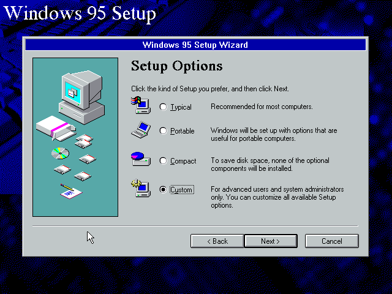
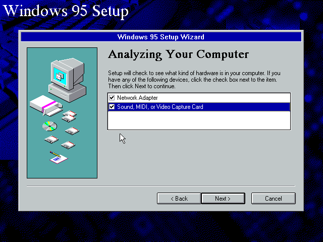
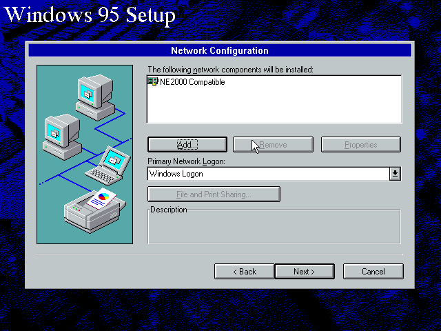
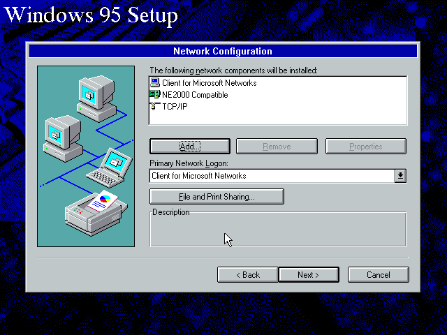
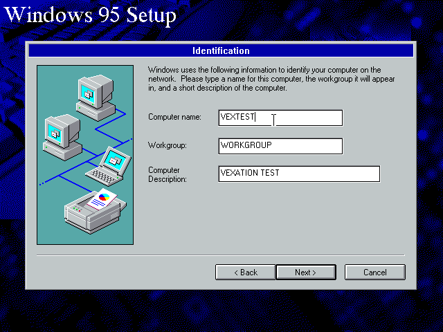
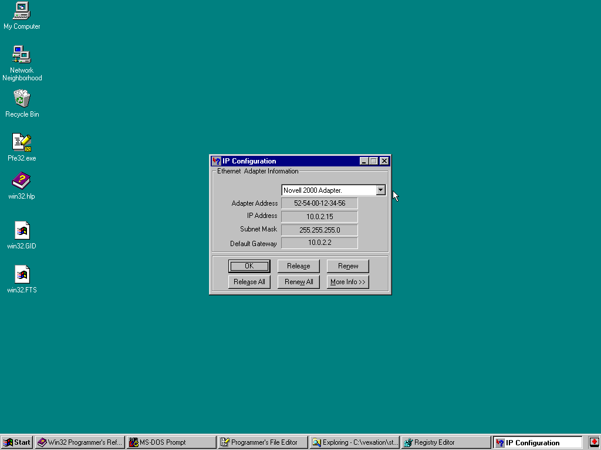
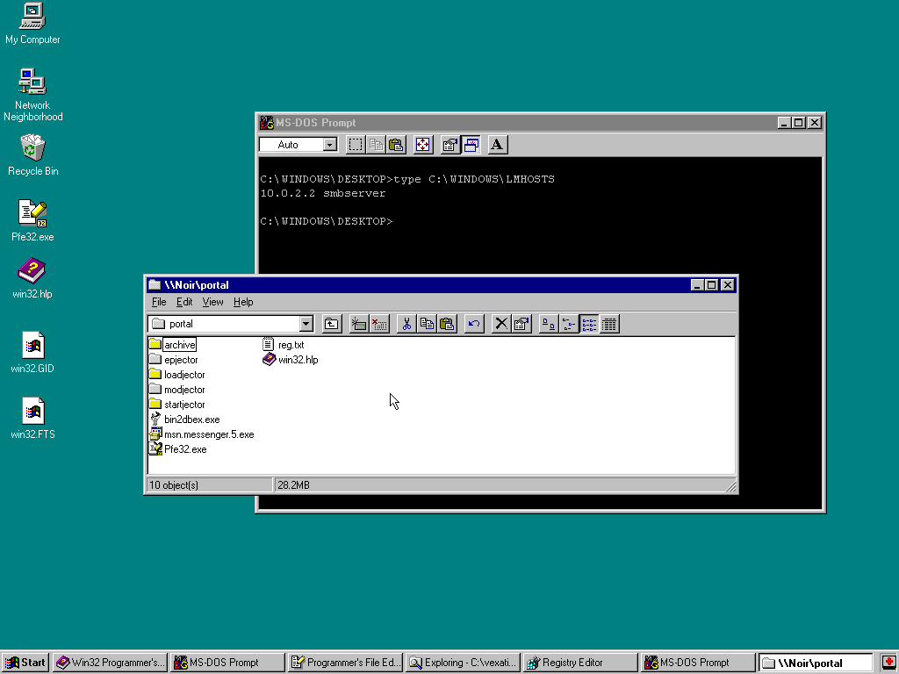

Welcome back! If this is your first visit to VeXation you may want to start at
[the beginning][Start].

[Start]: /welcome

# Recap and Yak Shaving

It's been some time since the [last post][Prev] and I was looking for a light
way to get back into the swing of things. Return readers might recall that I've
been doing all of the VeXation development in a Windows 95 VM running in
VirtualBox. I described the setup for this environment in [the second post in
the series][Setup] based on a popular [blog post][socket3] by socket3. 

Recently I've been using [NixOS][NixOS] on my laptop and I've been really happy
with the clean config I've arrived at. It felt crummy to sully my new system
with the ([dubious quality][virtualbox-taint]) VirtualBox kernel module just to
run a dinky Windows VM. Why not get back into the project with some dev. env.
yak shaving? In that spirit, today I'll walk through how I set up a new Windows
95 development environment with [QEMU][QEMU]/[KVM][KVM] and configured
file-sharing.

[Prev]: /entry-points
[Setup]: /setup
[socket3]: https://socket3.wordpress.com/2016/09/06/install-configure-windows-95-using-oracle-virtualbox/
[NixOS]: http://nixos.org/
[virtualbox-taint]: https://lkml.org/lkml/2011/10/6/317
[QEMU]: https://www.qemu.org/
[KVM]: https://www.linux-kvm.org/page/Main_Page

# QEMU/KVM

[QEMU][QEMU] is a light-weight machine emulator and virtualizer perfect for this
sort of project because it's both easy to script and has nice low-level features
in the monitor console. In my case, since I'm running a `qemu-system-x86` image
on a Linux host machine that is x86 compatible it made sense to pair QEMU with
[KVM][KVM], which QEMU [handily supports][QEMU-KVM]. On the quality front
I generally feel better loading an in-tree Linux kernel module like KVM than
I did with VirtualBox's 3rd party module.

To get everything set up I changed my NixOS config to add the `kvm-intel` kernel
module and to install the `qemu`, `qemu-utils` and `qemu_kvm` packages:

```
...
boot.kernelModules = [ "kvm-intel" ];
environment.systemPackages = with pkgs; [
  ...
  qemu
  qemu-utils
  qemu_kvm
];
...
```

After a quick `nixos-rebuild switch` I'm ready to get started creating
a Windows 95 VM. For this post I was using QEMU 5.1.0 on Linux Kernel 5.11.x.

[QEMU-KVM]: https://wiki.qemu.org/Features/KVM

# Windows 95 Setup

The [QEMU Wiki][QEMU-Wiki] has a [whole page for Windows 95][QEMU-Win95] but
it's unfortunately pretty old and recommends using command line flags that
result in warnings with modern QEMU. It also describes a clunky process for
digging through the virtual NIC's settings post-install to fix networking that
isn't necessary with some additional CLI flags. With some trial and error I was
able to arrive at a process that used up-to-date CLI flags and needed no
post-install messing around with IRQs.

[QEMU-Wiki]: https://wiki.qemu.org/
[QEMU-Win95]: https://wiki.qemu.org/Documentation/GuestOperatingSystems/Windows95

## Preparation

Like the [first setup post][Setup] I needed to gather a few resources before
starting:

* [Windows 95 OSR2.1 OEM CD][Win95OSR].
* [Windows 95 OSR2.X boot floppy][Win95OSRBoot].
* Windows 95 OEM License Key.
* [SciTech Display Doctor 7][SciTechDD7].
* [Borland Turbo Assembler 5.0][TASM5].

I downloaded and extracted all of the `.ISO` and `.IMG` files and put them in
a `disks` subfolder in preparation for mounting into QEMU as required.

[Win95OSR]: https://winworldpc.com/product/windows-95/osr-21
[Win95OSRBoot]: https://winworldpc.com/product/microsoft-windows-boot-disk/95-osr2x
[SciTechDD7]: https://retrosystemsrevival.blogspot.com/2019/05/scitech-display-doctor-7.html
[TASM5]: https://winworldpc.com/product/turbo-assembler/5x

## Creating the VM

To create the VM I first created a 2GB [QCOW2][QCOW2] disk image named
`vexation.qcow2` with `qemu-img`:

```bash
qemu-img create -f qcow2 vexation.qcow2 2G
```

Next I started up a VM backed by the QCOW2 disk image to begin the Windows 95
install.

```bash
qemu-system-i386 \
  -m 64 \
  -cpu pentium \
  -vga cirrus \
  -drive file=vexation.qcow2,format=qcow2 \
  -drive file=disks/Win95.OSR2.boot.img,format=raw,index=0,if=floppy \
  -cdrom disks/win95_full_ar.osr2_en.iso \
  -audiodev pa,id=snd0 \
  -netdev user,id=vexnet \
  -device ne2k_isa,irq=3,netdev=vexnet \
  -boot order=a \
  --enable-kvm
```

Let's talk through the more interesting `qemu-system-i386` parameters:

* `-m 64` - this gives the VM 64 MB of RAM. More than enough for Win95.
* `-audiodev pa,id=snd0` - this configures the VM to use PulseAudio for the
  virtual audio device backend.
* `-netdev user,id=vexnet` - this configures the VM with [user mode
  networking][QEMU-UserNet] and a named network.
* `-device ne2k_isa,irq=3,netdev=vexnet` - this configures the VM with
  a compatible virtual NIC and, **crucially**, sets the IRQ to 3 so I don't have
  to muck around with settings later.
* `-boot order=a` - this configures the VM to boot from the boot floppy.
* `--enable-kvm` - this enables KVM virtualization and makes the VM much faster.

Before figuring out the right `-audiodev` setting the sound "worked" but in
a way that resulted in some pretty interesting remixes...

`youtube: https://youtu.be/NGOFX_QpfEQ`

After the initial setup the same command can be used to boot the VM, but the
`-boot order=a` parameter should be changed to `-boot order=c`. I definitely
recommend making an alias or small script to avoid having to remember all of
these `qemu` params!

**Quick QEMU tips**: To stop the guest from eating mouse cursor/keyboard input
use `CTRL-ALT-G`. To enlarge the viewing area use `CTRL-ALT-+`. To drop to a
powerful QEMU monitor console use `CTRL-ALT-2` and list commands with `help`.

[QCOW2]: https://www.linux-kvm.org/page/Qcow2
[QEMU-UserNet]: https://wiki.qemu.org/Documentation/Networking#User_Networking_.28SLIRP.29

## Installing Windows

After the VM starts it's just the barren wasteland of a DOS prompt from the
Windows 95 boot floppy. The first order of business is to format the `C:\`
drive so I can launch the CDROM installer.

1. At the DOS prompt, I entered `fdisk`, input "Y", and chose defaults from
   there. At the end, when prompted, I reset the VM.

2. After the VM resets and I'm back at the DOS prompt I entered `format C:`,
   then "Y". At the end I gave the disk a stupid label.

3. Next I launched the Win 95 installer by running `D:\setup`

This time around I realized it's actually possible to configure TCP/IP during
the install process instead of after the fact if you choose "Custom" on the
screen titled "Setup Options" which was a nice optimization (_it saves one whole
reboot cycle!_).

In general I accepted defaults in most cases except for these exceptions:

* On the "setup options" screen, I chose "custom".



* On the "Analyzing your computer" screen, I clicked the checkbox for both
  "Network Adapter" and "Sound, MIDI, or Video Capture Card".



* On the "Network Configuration" screen I removed everything but the "NE2000
  Compatible" NIC.



  * Then I added a Protocol, choosing Microsoft from the Manufacturers list and
    "TCP/IP" from the Network Protocols list.
  * Then I added a Client, choosing Microsoft from the Manufacturers list and
    "Client for Microsoft Networks" from the Network Clients list.



* On the "Identification" screen, I set the workgroup to "WORKGROUP" in
  anticipation of using a boring Samba config for file-sharing between the host
  and VM.



* On the "Startup Disk" screen I chose "No, I do not want a startup disk".

At the final "Finishing Setup" screen I switch to the QEMU monitor with
`CTRL-ALT-2` and eject the boot disk with `eject floppy0`. After that it's safe
to let the VM reboot to complete the install.

The QEMU monitor console (`CTRL-ALT-2`) supports mounting/unmounting images as
required. To change the floppy disk image (e.g. to change the Borland TASM
install disk) use:

```
change floppy0 <path to floppy image>
```

To change the CD image use:

```
change ide1-cd0 <path to CDROM iso>
```

After the first boot I installed SciTools Display Doctor 7 and did the reboot
dance to get a better 1024x768 resolution. After that I installed Borland Turbo
Assembler 5.0 and edited `autoexec.bat` to add it to the system `PATH` with:

```
Set PATH=%PATH%;C:\TASM\BIN
```

Besides using the QEMU monitor to change the disk images the process was the
same as in [my previous setup post][Setup] so I won't bother repeating the steps
here.

## Networking and File-Sharing

In my previous [VirtualBox setup][Setup] I used bridge mode networking and
essentially put the Win95 VM on the real network (eek). To alleviate my fears
I would tactically enable/disable the virtual NIC to try and reduce the attack
surface of the VM. To share files I would connect from the host machine to
a shared folder exposed by the guest VM using `smbclient` manually. Overall it
was not a great setup...

This time around I chose to use QEMU's [user mode networking][QEMU-UserNet].
This meant the VM is not accessible to the wider network (but can still reach
out). I also decided to run a `smbd` process on my host machine that was only
exposed to `localhost` to allow the VM to easily mount a shared folder from the
host.

To start I verified the connectivity of the VM. If the IRQ of the virtual NIC
wasn't specified correctly in the `-device` argument to `qemu-system-i386`, or
it wasn't configured specifically to match the QEMU default in Windows device
manager you're likely to see no connectivity at this stage. Roughly my process
to confirm things were working was to:

1. Open a command shell.
2. Run `winipcfg` to see the current DHCP lease and associated config. The
   VM should have an IP like `10.0.2.15` and a default gateway of `10.0.2.2`.



3. Run `ping 10.0.2.2` to confirm the VM can ping the host.

When everything looked good I switched back to the host to configure Samba in
NixOS.

### Samba Configuration

QEMU has [a feature][QEMU-Samba] to launch `smbd` automatically with a special
config for VM/Host file-sharing but I couldn't get it working when I tried and
so ultimately decided to run a normal NixOS samba service on the host and
connect to it directly from the VM. To get Samba running on my host I updated my
NixOS config to add:

```
...
services.samba = {
  enable = true;
  securityType = "user";
  extraConfig = ''
    workgroup = WORKGROUP
    server string = NOIR
    netbios name = NOIR
    security = user
    hosts allow = localhost
    hosts deny = 0.0.0.0/0
    guest account = nobody
    map to guest = bad user
    load printers = no
    server min protocol = LANMAN1
  '';
  shares = {
    portal = {
      path = "/mnt/portal";
      browseable = "yes";
      "read only" = "no";
      "guest ok" = "yes";
      "create mask" = "0644";
      "directory mask" = "0755";
    };
  };
};
...
```

For the most part this is a vanilla Samba configuration to allow guest
read/write access to `/mnt/portal` on the host however there are a couple of 
notable changes:

* `workgroup = WORKGROUP` to match the Windows configuration.
* `hosts allow localhost` and `host deny = 0.0.0.0/0` to block access except for
  `localhost`.
* `server min protocol = LANMAN1` to allow Windows 95's crusty SMB stack to
  work with this modern Samba version (4.12.x).

Another `nixos-rebuild switch` and Samba is running and ready for the VM to
connect.

[QEMU-Samba]: https://wiki.archlinux.org/index.php/QEMU#QEMU's_built-in_SMB_server

## Configuring File-Sharing

Inside the VM I had to configure the host lookup behaviour for file-sharing by
editing `C:\WINDOWS\LMHOSTS` (with `notepad` in the GUI or `edit` on the command
line). This file needs to be updated to contain:

```
10.0.2.2 smbserver
```

Finally (after a reboot for good measure) it's possible to open `\\NOIR\PORTAL`
in the VM and share files to/from the host machine, all without broadly exposing
the VM (or its file-sharing) to the wider internet. Nice!



# Conclusion

Once file-sharing was set up it was easy to copy all of my work-in-progress code
and supporting resources (win32 API help, texteditor install, etc) from the host
to the VM. Overall it's much quicker to create and modify the VM using QEMU and
some small scripts compared to using the VirtualBox GUI. Additionally using user
mode networking with a localhost bound `smbd` makes me feel a little better
about security concerns. Another nice bonus is that the [QEMU
Monitor][QEMU-Monitor] supports a ton of really interesting functionality. Down
the road I expect commands like `dump-guest-memory` will become valuable
debugging tools.

Now that I have a working development environment recreated I'm ready to get
back to writing some assembly code and updating the virus with more
functionality. As a first task I think it would be fun to restore the
modification date of infected files to get a little bit more stealth on the
cheap. Hope to see you then!

As always, I would love to hear feedback about this project. Feel free to drop
me a line on twitter ([@cpu][twitter]) or by email
([daniel@binaryparadox.net][email]).

[QEMU-Monitor]: https://qemu.readthedocs.io/en/latest/system/monitor.html
[twitter]: https://twitter.com/cpu
[email]: mailto://daniel@binaryparadox.net
