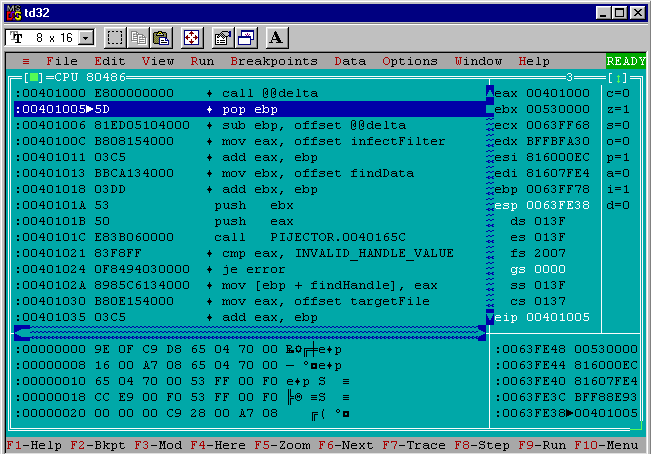
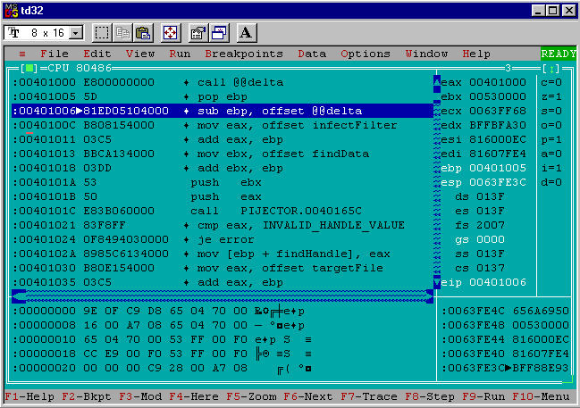
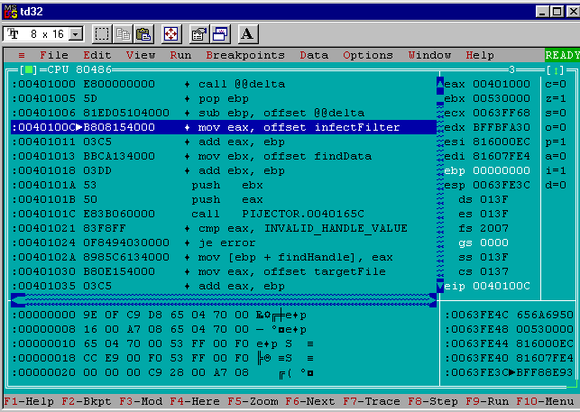
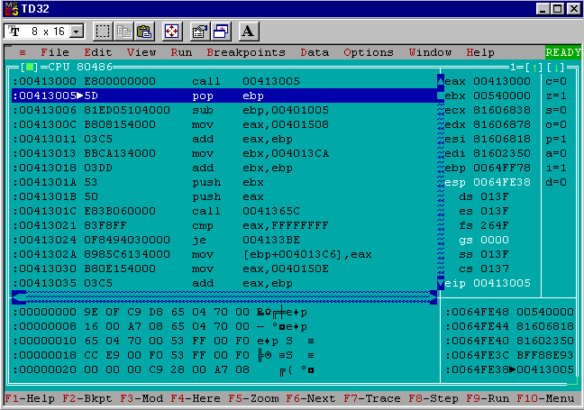
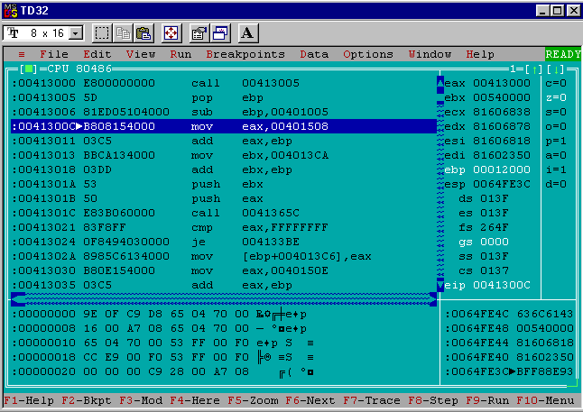

Welcome back! If this is your first visit to VeXation you may want to start by reading about [the project][welcome], the [development environment][setup], or the work in progress [PE infector virus][pe-infector] I'm extending in this post.

[welcome]: /2019/01/lets-write-a-virus/
[setup]: /2019/01/getting-set-up/
[pe-infector]: /2019/01/pe-file-infector-basics/

# Recap

At the end of the [last post][pe-infector] I completed [`minijector`](https://github.com/cpu/vexation/tree/main/minijector), a PE executable file infector virus that can add its code to `.exe` files found in the same directory by adding a new section to the to-be-infected target. There are a handful of shortcomings that prevent `minijector` from being a real functional virus. To recap, the virus code quickly falls apart for generations after 0:

1. The virus code relies on a data section that isn't copied into the infected program. Variable references will all be broken.
1. The way the virus code uses Win32 API functions will not work - a layer of indirection was broken and the first API function call will crash.
1. The virus code is inert. The entrypoints of infected programs aren't being updated.

Today I'll describe the approach I took to fix the first of these three problems: making the virus self-contained and position independent.

# Code and Data

A big problem with Minijector is that its `CODE` section refers to variables in a separate `DATA` section. When Minijector's code is copied into generation 1+ all of the variables are left behind and the references will be invalid!

I found it helpful to get an intuition for this using `tdump` on the `minijector.exe` executable. _(If this idea already makes plenty of sense to you feel free to [skip ahead](#code-is-data-is-code))_.

```text
Turbo Dump  Version 4.2.16.1 Copyright (c) 1988, 1996 Borland International
                  Display of File MINIJECTOR.EXE
<snipped>

Object table:
#   Name      VirtSize    RVA     PhysSize  Phys off  Flags
--  --------  --------  --------  --------  --------  --------
01  CODE      00001000  00001000  00000400  00000600  60000020 [CER]
02  DATA      00001000  00002000  00000400  00000A00  C0000040 [IRW]
03  .idata    00001000  00003000  00000200  00000E00  C0000040 [IRW]
04  .reloc    00001000  00004000  00000200  00001000  50000040 [ISR]
```

The `tdump` output shows there's both a `CODE` and a `DATA` section present in the object table and that each has a non-zero `PhysSize`. 

(_Side note: The names of these sections is a give-away that I used Borland Turbo Assembler. Other assemblers will choose different names. For example, `calc.exe` was built by Microsoft with a different set of tools and as a result it has a `.text` section instead of a `CODE` section_).

Turning to [a `tdump`](https://github.com/cpu/vexation/blob/master/minijector/calc.exe.tdump.txt) of a `calc.exe` instance infected by `minijector.exe` I can see there's just one new section above and beyond [the original](https://github.com/cpu/vexation/blob/master/minijector/calc.clean.exe.tdump.txt) `calc.exe` sections, `.ireloc`:

```text
Turbo Dump  Version 4.2.16.1 Copyright (c) 1988, 1996 Borland International
                     Display of File CALC.EXE

<snipped>

Object table:
#   Name      VirtSize    RVA     PhysSize  Phys off  Flags
--  --------  --------  --------  --------  --------  --------
01  .text     000096B0  00001000  00009800  00000400  60000020 [CER]
02  .bss      0000094C  0000B000  00000000  00000000  C0000080 [URW]
03  .data     00001700  0000C000  00001800  00009C00  C0000040 [IRW]
04  .idata    00000B64  0000E000  00000C00  0000B400  40000040 [IR]
05  .rsrc     000015CC  0000F000  00001600  0000C000  40000040 [IR]
06  .reloc    00001040  00011000  00001200  0000D600  42000040 [IDR]
07  .ireloc   00001000  00013000  00000400  0000E800  E0000020 [CERW]
```

Since the virus code was using **two** sections (`CODE` and `DATA`) in the original `minijector.exe` and there's only **one** new section in `calc.exe` (`.ireloc`) it's easy to understand there is a mismatch that needs to be addressed.

# Code is Data is Code

It's tempting to think about fixing this problem by duplicating the process generation 0 uses to copy its `CODE` section to the injected `.ireloc` section and using it to also copy a `DATA` section. Overall this approach seemed like the wrong solution to me. It will be more complex managing injecting multiple sections and as mentioned in the [previous post][pe-infector] adding a new section is already pretty clumsy from an AV evasion perspective. Continuing to pile new sections into a target isn't very appealing.

The route I decided to follow was to remove the `DATA` section entirely and have the virus maintain and update variables inside of its existing `CODE` section. I started by copying the `minijector` folder from the [VeXation repo](https://github.com/cpu/vexation) to create [a `pijector` folder](https://github.com/cpu/vexation/tree/master/pijector) (_position independent (in)jector, get it?_). Updating all of the old `"minijector"` references in the `Makefile`, `.inc`, `.def`, and `.asm` files was enough to get started on a position independent version of `minijector`.

From an Assembly programming standpoint there's only one change that needs to be made. The [old `.data` section](https://github.com/cpu/vexation/blob/b3a2897311aa8c358d0ec1a24b9b8f045cfb21f1/minijector/minijector.asm#L23-L48) from `minijector.asm` is moved [inside of the `.code` section](https://github.com/cpu/vexation/blob/4bf1084bffdfaf1b3d0c5cf3a2c137e107145137/pijector/pijector.asm#L465-L491). Done!

For unsatisfying and vague reasons I found I couldn't delete the `.data` section outright or `tasm32` and `tlink32` would wig out and create a generation 0 binary that would crash immediately. Rather than spend time figuring out why I decided to hack around it by [adding a tiny `.data` section](https://github.com/cpu/vexation/blob/4bf1084bffdfaf1b3d0c5cf3a2c137e107145137/pijector/pijector.asm#L13-L22) that isn't used for anything:

```tasm {linenos=table}
.data
  DB ?
```

With the old `.data` section moved to `.code` and replaced with an empty `.data` section the assembled `pijector.exe` should have a non-empty `CODE` section and an empty `DATA` section on disk. A quick `tdump` shows that this worked out as expected:

```text
Turbo Dump  Version 4.2.16.1 Copyright (c) 1988, 1996 Borland International
                   Display of File PIJECTOR.EXE

<snipped>

Object table:
#   Name      VirtSize    RVA     PhysSize  Phys off  Flags
--  --------  --------  --------  --------  --------  --------
01  CODE      00001000  00001000  00000800  00000600  60000020 [CER]
02  DATA      00001000  00002000  00000000  00000E00  C0000040 [IRW]
03  .idata    00001000  00003000  00000200  00000E00  C0000040 [IRW]
04  .reloc    00001000  00004000  00000200  00001000  50000040 [ISR]
```
 
Unlike before the `PhysSize` of the `DATA` section is now `00000000`.

# The trap of position dependence

Consolidating to one section is a step in the right direction but it's only a half-solution for making sure the virus code from generation 0 still works when run from a new location in generation 1+.

I found it was easier to understand the remaining problem by poking at it with some tools. Running `td32` on an old `minijector.exe` build without debug symbols makes it easy to see how variable references in the code end up looking in the assembled executable.

There's an example of variables being used [right at the beginning of the `minijector.asm` code](https://github.com/cpu/vexation/blob/4bf1084bffdfaf1b3d0c5cf3a2c137e107145137/minijector/minijector.asm#L54-L63) that shows the problem in concrete terms:

```tasm {linenos=table}
findfirst:
  mov eax, offset infectFilter
  mov ebx, offset findData
  call FindFirstFileA, eax, ebx
  <snipped>
  mov [findHandle], eax

```

Here `eax` and `ebx` are being used as arguments to `FindFirstFileA`. Both arguments are a pointer to a memory address. In this case pointers to the memory addresses of the variables `infectFilter` and `findData` respectively. After calling `FindFirstFileA` the result in the `eax` register is saved in the `findHandle` variable.

In `td32` the debugger's view of this code's disassembly looks a little bit different. Most importantly the `offset infectFilter`, `offset findData` and `[findHandle]` instances have been replaced with memory addresses:

```tasm {linenos=table}
mov eax, 004014E6
mov ebx, 004013A8
push ebx
push eax
call PIJECTOR.0040163A
; <snipped>
mov [PIJECTOR.004013A4], eax
```

The addresses of the variables are offsets from where the OS loaded `minijector.exe` in memory, the **base address**. 

In this case the base address is `0x00400000` and the `infectFilter` variable is at an offset of `0x14E6`, the `findData` variable is at an offset of `0x13A8` and the `findHandle` variable is at an offset of `0x13A4`. 

(_Side Note:_ You can also see the [stdcall calling convention](https://en.wikipedia.org/wiki/X86_calling_conventions#stdcall) in action here. In the debugger view you can see the assembler helpfully replaced the arguments to each `call` instruction with `push` operations in the correct reversed order for the convention in use.)


The `infectFilter`, `findData` and `findHandle` offsets work correctly in generation 0 because the assembler and linker calculated them knowing where the `CODE` section will be relative to the loaded base address. 

The same offsets will be a complete disaster in later generations because the virus code from the generation 0 `CODE` section won't be located in the expected place anymore (the first section in the executable). Instead it will be running from the `.ireloc` section that gets appended at the **end** of infected executables.

For example if the `findfirst` code from above were injected into `calc.exe` the offset for the `infectFilter` variable (`0x14E6`) would be pointing somewhere inside `calc.exe`'s original code in the `.text` section and **not** at the location of the infection filter variable in the virus code. That's obviously not going to work so what can be done?

# Enter, the Δ offset

The solution to this problem is a well known trick in the VX and AV community called _"the delta offset"_.

The core idea is to figure out at runtime the difference in location between where the virus code was originally being run in generation 0, and the location where the virus code is currently running in an infected executable. The difference in location is the **delta offset** and by adding it to all of the original variable offsets in the virus code they will remain correct even when the code is moved to a new location.

## Calculating the delta offset

There are a handful of different ways to compute a delta offset but the standard textbook approach is to exploit the relative nature of `call` and its effect on the stack. Here's an example:

```tasm {linenos=table}
  call @@delta
@@delta:
  pop ebp
  sub ebp, offset @@delta
  ; ebp is now the ~*[ holy delta offset ]*~
```

How does this magic incantation work? Well, there's a lot going on in just ~4 lines of assembly so let's break it down.

The first `call` on L1 is to a locally scoped label (`@@delta`, on L2) for the address immediately after the `call` instruction (L3). When the `call` instruction is executed the return address (the address of the instruction after `call`) will be pushed onto the top of the stack as a side-effect of how `call` works.

In this case however we don't care about returning from a procedure call, we just want to know where this code is executing from in memory. A `pop` of the top of the stack into `ebp` (L3) puts the return address from the `call` instruction that was just executed into `ebp` (recall that the return address will be the address of the instruction after the `call`, the `pop ebp` instruction on L3).

Now comes the last trick on L on L44: subtracting the original label offset (`offset @@delta`) from the address of the `pop ebp` instruction (currently in `ebp`). This gives the difference between where the `pop ebp` instruction would have been in generation 0 and wherever the `pop ebp` instruction happens to be now: the delta offset!

## Using the delta offset

I used `ebp` to hold the delta offset in the above snippet and in my virus code so to rewrite the original `findfirst` snippet to be position independent means going from something like:

```tasm {linenos=table}
findfirst:
  mov eax, offset infectFilter
  mov ebx, offset findData
  call FindFirstFileA, eax, ebx
  <snipped>
  mov [findHandle], eax

```

to an updated version that takes into account the delta offset in `ebp` for each variable reference:

```tasm {linenos=table}
findfirst:
  mov eax, offset infectFilter
  add eax, ebp
  mov ebx, offset findData
  add ebx, ebp
  call FindFirstFileA, eax, ebx
  <snipped>
  mov [ebp + findHandle], eax

```

In `pijector.asm` I rewrote all of the original `minijector.asm` variable references following the same process shown above. Now the virus code and variables are self-contained in the `DATA` section and the variable references are position independent thanks to the delta offset!

# Patching the target entrypoint

In order to see the delta offset calculation in action it's handy to have executables infected by generation 0 actually **run** the virus code when the infected executable is started.

In future posts I'll cover how to do this correctly so that when the virus code is finished doing its dirty work it can return execution to the infected program's original entry point. For now because the virus code is still incomplete I can update the entry point to jump to the virus code and not worry about anything else. The infected programs will be broken but that's fine for now.

To get the virus code to be executed by the infected program I updated `pijector.asm` to [set the entry point of the target executable](https://github.com/cpu/vexation/blob/4bf1084bffdfaf1b3d0c5cf3a2c137e107145137/pijector/pijector.asm#L312-L313) to the starting virtual address of the `.ireloc` segment (stored in `eax`):

```tasm
  ; While we have the virtual address pointer handy patch the entrypoint
  mov (IMAGE_NT_HEADERS [ecx]).OptionalHeader.AddressOfEntryPoint, eax
```

# Complete Assembly code

The complete `pijector` assembly code is available in the [VeXation github repo](https://github.com/cpu/vexation/) in the [pijector folder](https://github.com/cpu/vexation/tree/master/pijector).

Like with Minijector the code can be built by running `make` in the `pijector` directory (Or use `make` with a `-DDEBUG` argument to build with debug symbols). Executing `make run` will copy a clean `calc.exe` into the project directory and start `pijector.exe` in Borland Turbo Debugger. That will let you step through infecting `calc.exe`. _Remember that after being infected `calc.exe` will be broken because the virus isn't complete yet but the entry-point was changed._

## Observing the delta offset in action

The delta offset is confusing to reason about statically. I found it much easier to understand when I could step through generation 0's calculation and compare it to generation 1's calculation. Here's a brief run through of how I did that.

First I ran `make clean` and `make -DDEBUG` in the `pijector` directory to get a debug build. Then I ran `make run` to step through generation 0 in the debugger. 

For this task I found it useful to use the "CPU" view instead of the source view so I clicked "View" then "CPU" and then maximized the CPU view window.

### Generation 0


After the debugger loads execution is paused on the first part of the delta offset calculation at address `0x00401000`. In the bottom right I can see the top of the stack is at address `0x0063FE3C` and the value is `0xBFF88E93`.

After stepping forward one instruction by pressing `F8` the debugger will look as follows in the CPU view window:



Now the top of the stack is `0x0063FE38` and has the new value `0x00401005`. I can cross-reference that with the primary disassembly view to see that `0x00401005` is the address of the `pop ebp` instruction, just as expected.

After stepping forward with `F8` once more the debugger will look as follows:



Now the virus code has popped the top of the stack into the `ebp` register and it holds the value `0x00401005`. This value is the address of the `pop ebp` instruction, so far so good.

Finally by pressing `F8` one last time the debugger will show the end of the delta offset calculation:



Now `offset @@delta` has been subtracted from `ebp` and it's left holding the value `0x00000000`.

Wait a second. All zero? Is that right?

Yes! Remember that this is generation 0 so the code is executing from the place the assembler/linker put it. All of the original offsets are correct as-is. In this case the delta offset that needs to be applied is 0 and so the calculation is correct.

After hitting `F9` to continue execution the `pejector.exe` process will finish its work and terminate and I'm left with an infected `calc.exe` to repeat the process with.

### Generation 1

Now that I have an infected generation 1 `calc.exe` I can see how its delta offset calculation produces a different result than generation 0. 

Running `td32 calc.exe` loads the generation 1 program and pauses execution at a debugger screen like this (after dismissing the warning about missing symbols):


Right away I can use the debugger's output to see the entry point patching worked because the debugger is paused at `0x00413000` which is the base address of where `calc.exe` is loaded (`0x00400000`) plus the RVA of the `.ireloc` section [shown in `tdump calc.exe`](https://github.com/cpu/vexation/blob/master/pijector/calc.infected.exe.tdump.txt) (`0x00013000`). The disassembly is also clearly the delta offset calculation from the virus code and not some part of the original `calc.exe` code.

Now I can follow the same process as before, single stepping with `F8` and watching the delta offset calculation happen piece by piece. After one step forward the debugger view will look as follows:



Like before the `call` instruction changed the top of the stack. Now the top of the stack is `0x0064FE38` and has the value `0x00413005`. That's the address of the `pop ebp` instruction that follows the `call` in the disassembly view so the calculation appears the same as generation 0 so far.

Stepping forward once more with `F8` gives the following view:


Now `ebp` holds `0x00413005`, the address of the `pop ebp` instruction after the `call`. This still matches what happened in generation 0, no surprises.

One more step forward with `F8` shows the critical difference in generation 1's delta offset calculation:



After subtracting `offset @@delta` the `ebp` register is left with the value `0x00012000` and not `0x00000000`. This value (`0x00012000`) is the generation 1 delta offset!

The easiest way to verify this is the correct delta offset for the `calc.exe` generation 1 infection is to compare the `tdump` of the generation 0 `pijector.exe` and the infected `calc.exe`.

```text
---------------------------[ Generation 0 ]--------------------------------
Turbo Dump  Version 4.2.16.1 Copyright (c) 1988, 1996 Borland International
                   Display of File PIJECTOR.EXE
<snipped>
Object table:
#   Name      VirtSize    RVA     PhysSize  Phys off  Flags
--  --------  --------  --------  --------  --------  --------
01  CODE      00001000  00001000  00000800  00000600  60000020 [CER]
02  DATA      00001000  00002000  00000000  00000E00  C0000040 [IRW]
03  .idata    00001000  00003000  00000200  00000E00  C0000040 [IRW]
04  .reloc    00001000  00004000  00000200  00001000  50000040 [ISR]

---------------------------[ Generation 1 ]--------------------------------
Turbo Dump  Version 4.2.16.1 Copyright (c) 1988, 1996 Borland International
                    Display of File CALC.INFECTED.EXE
<snipped>
Object table:
#   Name      VirtSize    RVA     PhysSize  Phys off  Flags
--  --------  --------  --------  --------  --------  --------
01  .text     000096B0  00001000  00009800  00000400  60000020 [CER]
02  .bss      0000094C  0000B000  00000000  00000000  C0000080 [URW]
03  .data     00001700  0000C000  00001800  00009C00  C0000040 [IRW]
04  .idata    00000B64  0000E000  00000C00  0000B400  40000040 [IR]
05  .rsrc     000015CC  0000F000  00001600  0000C000  40000040 [IR]
06  .reloc    00001040  00011000  00001200  0000D600  42000040 [IDR]
07  .ireloc   00001000  00013000  00000800  0000E800  E0000020 [CERW]
```

In the `pijector.exe` `tdump` output the `CODE` section is located at RVA `0x00001000`. In the infected `calc.exe` the `.ireloc` section is located at RVA `0x00013000`. 

Taking `0x00013000 - 0x00001000` gives `0x00012000`, the same delta offset that `calc.exe` calculated at runtime. Right-on! Now throughout this instance of the virus code variable references can be corrected for their current location by simply adding `0x00012000` to the original variable offset.

# Closing notes

There is still **one** big problem left to address before `pijector` could be a real functional virus: the way the virus code uses Win32 API functions won't work in generations 1+. 

If a program infected by `pijector` is run it will immediately crash at the first invocation of `FindFirstFileA`. Fixing this problem is going to take even more runtime contortions and I'll save that for the next post :-) _It's a lot of work to make a functional virus!_

Beyond that big problem there's also a smaller problem: the generation 0 `pijector.exe` binary will only work if it's run under `td32` or another debugger. The reason is fairly simple to understand: moving the old `.data` section into the `.code` section means the virus is **writing** to its own code section and that's not what Borland Turbo Assembler expected: it created the section read-only.

When `tasm32/tlink32` builds the generation 0 `pijector.exe` binary the `CODE` section it creates is marked `CER` (contains code, executable, readable). Notably it doesn't have the `W` flag for "writable". This is only a problem for generation 0 because every subsequent generation will have virus code located in a section that the previous generation of the virus created, not Borland, and the virus code always makes the sections it creates writable. 

The generation 0 binary works correctly when run in `td32` because it (and other debuggers) make the code section of the debugged program writable in order to be able to add breakpoints. One way to remove the dependence on using a debugger to run generation 0 is to write a small utility program that can edit generation 0's `CODE` section metadata after the executable is built to have the writable flag. I'm already strapped for time so for now I live with always running generation 0 in a debugger :-)

Thanks for sticking with me while I go on this VXing journey. As always, I would love to hear feedback about this project. Feel free to drop me a line on twitter ([@cpu](https://twitter.com/cpu)) or by email ([daniel@binaryparadox.net](mailto://daniel@binaryparadox.net)).
