Virus writing starts with a development environment. Here's how I set up a Windows 95 VM and my development tools. If this is your first visit to VeXation you might want to start by reading the ["Welcome" post introducing the project][welcome].

Before going too far I think its valuable to get into a 1995 mindset: Coolio's [Gangster's Paradise](https://www.youtube.com/watch?v=fPO76Jlnz6c) is the [#1 single](https://en.wikipedia.org/wiki/Billboard_Year-End_Hot_100_singles_of_1995). Quebec [narrowly remains a province of Canada](https://en.wikipedia.org/wiki/1995_Quebec_referendum). A pog collection was [still cool](https://www.complex.com/style/the-rarest-pogs-from-the-90s/). Netscape only recently released SSL and faces challenge from a brand new web browser called Internet Explorer. A top of the line home PC was something like a [486 with a 1 GB harddrive and a whopping 8mb of RAM](http://file.vintageadbrowser.com/pdvne4ihtorfz3.jpg).

Let's take this new Windows 95 thing for a spin.

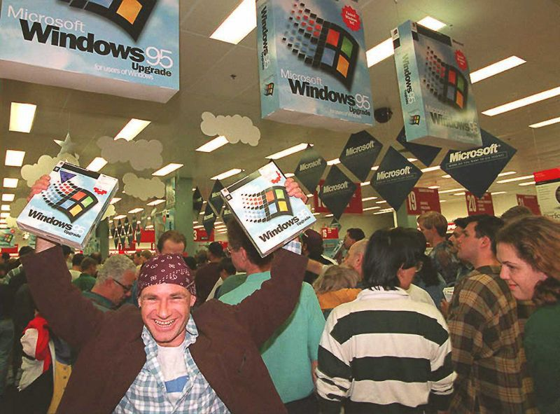

[welcome]: /2019/01/lets-write-a-virus/

# Software Choices

## Virtualization

I'm writing this post from Linux and will be using [VirtualBox](https://www.virtualbox.org/) for virtualization. There are other ways to run Windows95 but **VirtualBox** is the devil I know. In theory most of this setup could be adapted to macOS or modern Windows but you'll have to try that on your own. Luckily for me most of the hard work involved in setting up Windows 95 with VirtualBox was covered by [Socket3's blog post on the subject](https://socket3.wordpress.com/2016/09/06/install-configure-windows-95-using-oracle-virtualbox/). Rather than duplicate that effort I will defer to that post for the basic setup instructions and only point out areas of difference. 

## Windows 95 Version

There are a number of versions of Windows 95 available. To make things simple I chose to use the same one as Socket3: **Windows 95 OSR 2.1**. Later on I'll want to test code on a few versions to make sure differences in patch level don't break things.

## Assembler/Linker/Debugger

I don't know if its true but I get the impression the prevailing choice for writing `ASM` malware in the 90s was [Microsoft Macro Assembler](https://en.wikipedia.org/wiki/Microsoft_Macro_Assembler) (almost always referred to as `MASM`). To spice things up a little bit I decided it would be fun to try using Borland [Turbo Assembler](https://en.wikipedia.org/wiki/Turbo_Assembler) (almost always referred to as `TASM`). I ended up choosing **Borland Turbo Assembler 5.0**. It was easy to install and supported 32bit Win32 development. `TASM` has fairly extensive `MASM` compatibility so this turned out to be an OK decision. If all else fails it's fun to say "Borland" out loud (I recommend you try it).

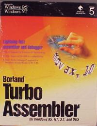

## Text Editor

This part was a real struggle. I tried a few random "Programmer's Text Editors" that I could remember (Notepad++, UltraEdit, etc) but couldn't get any of them to install on a fresh Windows 95 OSR 2.1 system. This was probably because I was using newer versions meant for Win98+ but it was tedious digging up old installers to try. Ultimately I ended up choosing an ancient freeware program called the [Programmer's File Editor](https://www.lancaster.ac.uk/~steveb/cpaap/pfe/) (PFE). Compared to a modern IDE it is somewhat feature bare but it sure is... _"authentic"_. Using **Programmer's File Editor** does provide important features missing from notepad.exe like line numbers and being able to open files > 64KB. Best of all PFE is [_probably_ Y2K safe](https://www.lancaster.ac.uk/~steveb/cpaap/pfe/year2000.htm).


# Installing Windows 95 OSR 2.1

To install Win95 in VirtualBox I followed [Socket3's blog post on the subject](https://socket3.wordpress.com/2016/09/06/install-configure-windows-95-using-oracle-virtualbox/).  If you're following along you'll want to download the following:

1. [Windows 95 OSR 2.1 OEM CDROM ISO](https://winworldpc.com/product/windows-95/osr-21)
1. [Windows 95 Bootdisk floppy disk image](https://drive.google.com/open?id=0B2BOLB8yC3mnTWtwSVk0X0NpZEE)
1. [SciTech Display Doctor 7.0 Beta](https://drive.google.com/open?id=0B2BOLB8yC3mnbUg3YTVYd0JlU1U)

You will also need a valid Win95 _"Certificate of Authenticity"_ serial number. These are all over the internet but I'll save you a Google and share the one I used (_if you're a cop stop reading this_): 

```text
24796-OEM-0014736-66386
```

I chose to use some virtual machine settings that aren't true to the period to make life a little more bearable. I created a VM with a Pentium processor, 64mb of RAM and a 2GB disk. Don't forget to disable VT-x/AMD-V and Nested Paging in the CPU settings.

Using a floppy disk image to bootstrap CDROM drivers to be able to run the Win95 installer CD is certainly nostalgic. In the VM the overall install time is quite fast compared to 1995 when it would often take most of an hour.

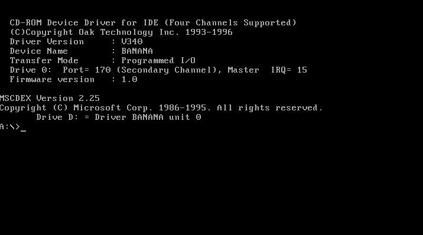

Socket3's instructions worked as described except for a few minor things I had to adapt:

1. The CDROM drive did not default to drive `R:\` - instead it was drive `D:\` like I would have expected. I replaced any references to `R:\` with `D:\`. I also skipped editing `autoexec.bat` to rename the CDROM drive.
Despite it being drive `D:\` I did have to follow the described process of copying 
`*.cab` files from the CDROM to the harddrive before starting the installation process or trouble would ensue.
1. The process of copying CDROM files to drive `C:\` in Socket3's post is described before the `fdisk` and format process that prepares drive `C:\`. I had to reverse this order and prepare the drive before copying to it. Remember to restart the VM after partitioning and formatting.

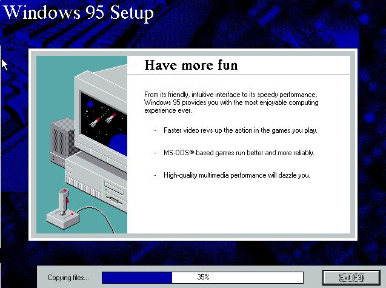

Getting the somewhat sketchy SciTech Display Doctor driver installed and configured is a little fiddly but the improved screen resolution is worth it. I had to drag around the SciTech application interface a bit before I could see the "Apply" button I needed to click to change the Display and Graphics Drivers to follow Socket3's instructions.

Following the network setup instructions was important to me because I knew I would want to copy files to the VM from my host machine (installers, goat files, etc). If you want to do the same make sure not to forget to reinstall "Client for Microsoft Networks" after you install the TCP/IP protocol because it will be removed when you first remove NetBEUI and IPX/SPX.  I put the VM on a network that did not have a DHCP server and so I also had to configure the system IP Address, Gateway, and DNS Configuration manually. Get used to restarting your VM because _Literally Everything_ requires rebooting in Windows 95: installing a new driver, changing the screen resolution, changing the system IP address, you name it.

One important thing to point out is that Socket3's approach to VM networking bridges the VM to your host machine's network adapter which means **you may effectively be putting a Windows 95 machine on the big scary Internet unless you're careful**. I gave up on using VirtualBox NAT so ultimately I "airgap" the VM by strategically connecting/disconnecting the network adapter virtual cable when I want to send/receive files. The irony of getting a virus while trying to develop a virus would be too much for me to bear.

## Setting up File Sharing

There are no VirtualBox guest additions for Windows95 which means I couldn't use conventional means to share files between the host and the guest. I tried mounting the VM's FAT32 disk image directly into Linux using various tricks but found it unreliable and annoying because the guest had to be shut down first. Out of the box Win95 OSR 2.1 has IE 4.0 so browsing the web to download tools is a nightmare. Barely any sites will work and prolonged exposure to the wild internet is almost guaranteed to leave you more hacked than Marriott. The best solution I could find without getting lost in yak shaving was to enable Windows file sharing in the VM. I use a Linux samba client from my host machine to interact with the VM shared folder.

File sharing isn't enabled out of the box so after configuring TCP/IP and connecting the virtual cable again (_plz don't hack me_) I enabled and configured it. To do so yourself:

1. Right click Network Neighbourhood and choose properties
1. Click the ugly button labelled "File and Print Sharing"
1. Click _"I want to be able to give others access to my files"_
1. Click OK
1. Insert the Windows 95 install CDROM again if you've removed it
1. Click Yes to restart your computer (of course you have to restart your computer for this)
1. Create a folder in your C:\ drive called "portal"
1. Right click the folder and choose properties
1. Click the "Sharing" tab
1. Configure a share name and access type for the folder
1. I found it easiest to access the shared folder on the VM from my host using a command line SMB client called, unsurprisingly, `smbclient`. To download a TAR archive of some files in the portal directory is as easy as running:

```bash
smbclient //VMNAME/PORTAL "" -N -Tc backup.$(date +%Y-%m-%d-%s).tar <files>
```

To poke around in an interactive mode is even easier:

```bash
smbclient //VMNAME/PORTAL ""
```

The [smbclient man page](https://man.archlinux.org/man/smbclient.1) has plenty more information. Remember to disconnect the virtual network cable when you're done. Also note that `"VMNAME"` in the above commands is a placeholder for the name I chose to identify the computer in Windows file sharing settings, not the VirtualBox VM name.

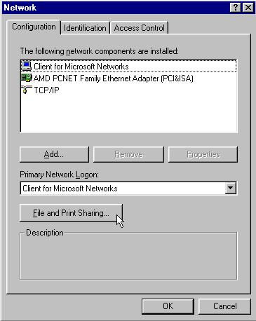

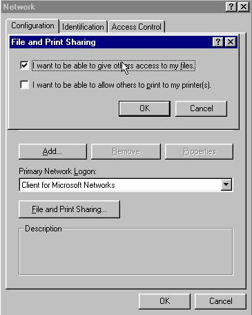

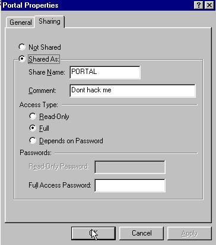

# Installing Borland Turbo Assembler 5.0

Overall this was a straight-forward process. To begin I had to download the three floppy disk images for the Borland Turbo Assembler 5.0 installer. You can find these on Win32World as a [7z archive](https://winworldpc.com/product/turbo-assembler/5x). If you're following along you'll need a way to unzip 7z files to get at the individual disk images you can mount as virtual floppy disks for the VM using VirtualBox.

After mounting `disk01.img` to the virtual floppy drive I was able to begin the installation. One way to do this is to:

1. Open My Computer
1. Double click the `A:\` drive
1. Double click the "Install" icon
1. Hit enter as required to proceed
1. Leave all the defaults and choose Start Installation
1. Mount disk #2 and disk #3 when prompted
1. When `TSM_RDME.TXT` is displayed the installation is complete. Hit ESC to exit. 1. Don't forget to eject the floppy disk before you reboot the VM or the next boot-up will try to boot from the Borland floppy and fail.

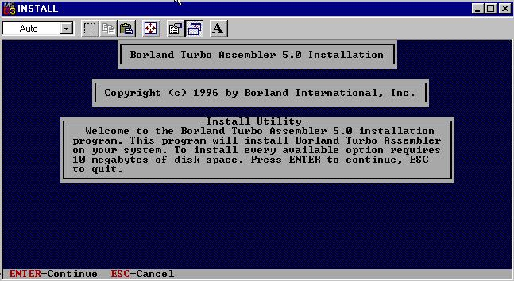

Next I had to add the TASM tools to the `%PATH%` environment variable so I can use the tools easily from a command prompt without a fully qualified path. For Win95 this means editing the `Autoexec.bat` script. One way to do so:

1. Open My Computer
1. Open the `C:\` drive
1. Right click "Autoexec" and choose "Edit"
1. The file will probably be empty since this is a fresh installation. I added the following line: `Set PATH=%PATH%;C:\TASM\BIN`
1. Save the file and exit
1. Reboot (of course)

I was able to verify that I had a working installation and gain some basic familiarity with the tools by building one of the Win32 sample applications that comes with TASM. To do this:

1. Open a command prompt (My favourite way is to hold the windows key, hit "r", enter `command` and then hit enter)
1. Change to the "wap32" example directory by running `cd C:\TASM\EXAMPLES\WAP32`
Build the sample application by running `make`. If you get the error "Bad command or file name" you should double check your `%PATH%` was setup correctly. It's expected to see two warning messages about heap and stack reserve size (_Shout out to the Borland dev that shipped example code that builds with warnings..._).
1. Run the built application by running `wap32` in the console
1. You should see an ugly win32 application window appear
1. You can try debugging the application by running `td32 wap32`. Because we built the sample application without debug symbols the debugger will warn us about this fact and only show disassembled machine code
1. You can try debugging **with** symbols by running `make -B -DDEBUG`. The `-B` forces a rebuild even though the sourcecode hasn't changed. `-DDEBUG` passes a `DEBUG` argument to the `Makefile` so it can change the assembler and linker command line flags
1. After rebuilding with debug symbols you can run `td32 wap32` again and it should not warn about missing debug symbols anymore and instead show you a source code listing. Much nicer!

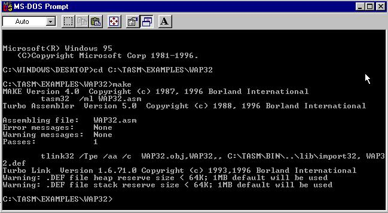

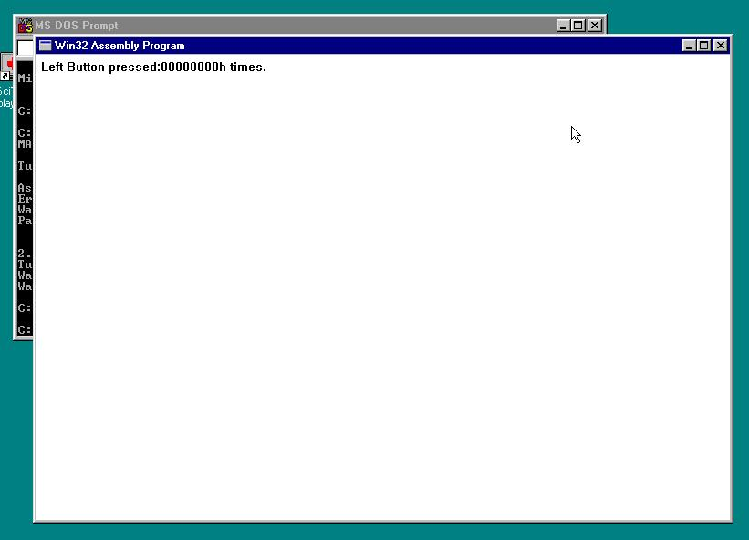

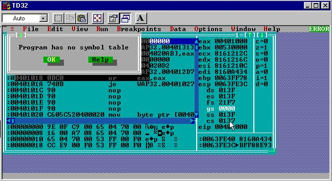

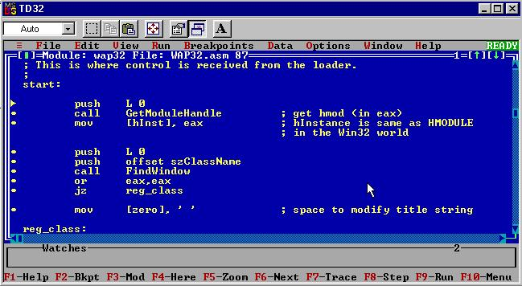

# Wrapping Up

Cool! A real development environment. If you followed along I recommend that you create a snapshot of the VM state at this point so no matter how screwed up things get you can always return to a fresh setup. It would also be useful to duplicate these setup instructions to make a few more Windows 95 VMs that you can use to test your virus down the road without infecting your development machine.

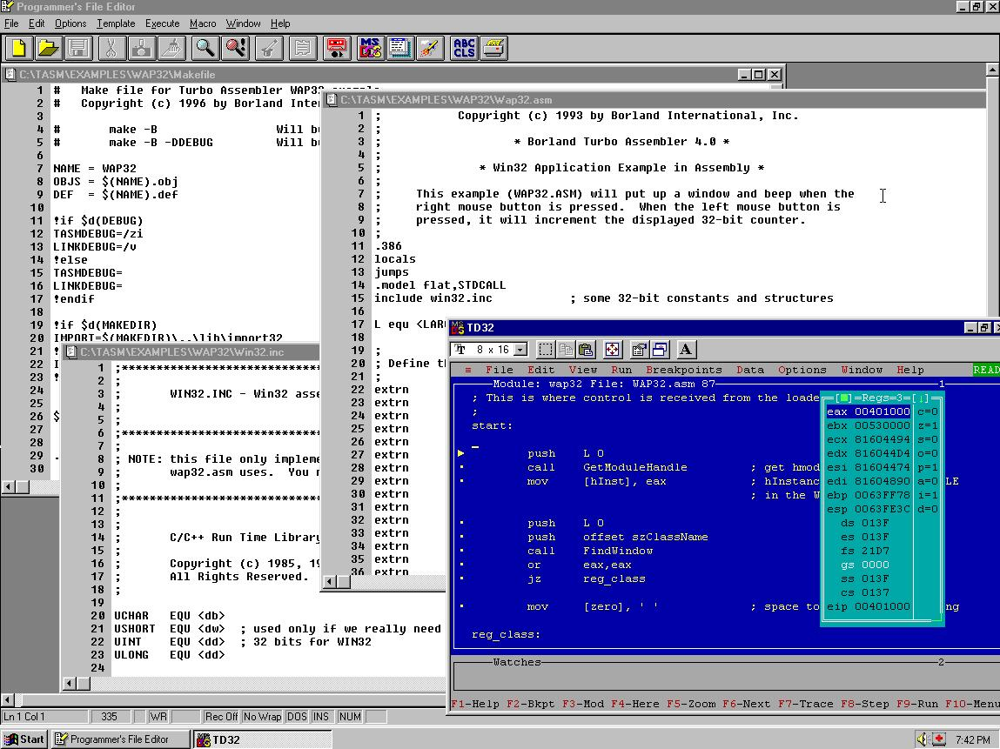

_**Bonus fact:** If you've read [Fabien Sanglard](https://fabiensanglard.net/)'s excellent [Game Engine Black Book: Wolfenstein 3D](http://fabiensanglard.net/gebbwolf3d/index.html) you might noticed the td32 debugger interface looks just like the one shown in Chapter 3. John Carmack and id software used Borland Turbo C++ for the development of Wolf 3D and it came bundled with Borland Turbo Debugger (though we've installed a newer version)._

At this point I spent most of my time reading the [Borland Turbo Assembler 5.0 manual](https://binaryparadox.net/d/tasm.pdf) and browsing through the WAP32 source code. It was a pretty good starting example for win32 programming in x86 assembly. Once I had a grasp of WAP32 I dipped my toes into some of Iczelion's win32 ASM tutorials(_sadly, these appear to have disappeared from the internet in the time since writing_). These are mostly MASM based but work with TASM with minimal fuss. Compared to 2019's version of development tutorials and medium dot com think-pieces I found these older "community style" tutorials very endearing if not always crystal clear.

You might have been surprised to see the `make` command show up in a Win95 dev environment. I admit I was. Initially I assumed it would be something similar to GNU Make and I definitely set myself up for disappointment. In reality it's some kind of proprietary [Borland flavour of Make](ftp://ftp.kis.p.lodz.pl/pub/people/T.Koszmider/Bp/tasm/doc/make.txt) that is missing a lot of what I associate with GNU Make. It takes some getting used to, especially when paired with the lousy `command.exe` shell Win95 offers. Overall it's still nicer (_to me anyway_) than writing `BAT` files.

With the dev env ready I can move on to more interesting topics. Next time I'd like to talk about the theory behind PE infectors and some challenges that we'll face compared to standard application development.

I would love to hear feedback about this project, especially if you were someone writing assembly code in this era. Feel free to drop me a line on twitter ([@cpu](https://twitter.com/cpu)) or by email ([daniel@binaryparadox.net](mailto://daniel@binaryparadox.net)).

Until next time,
