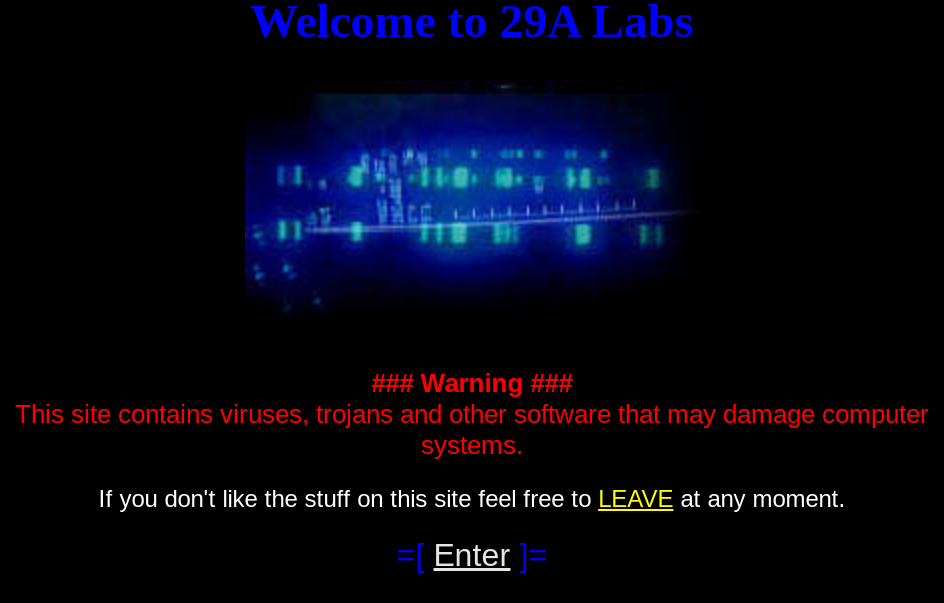
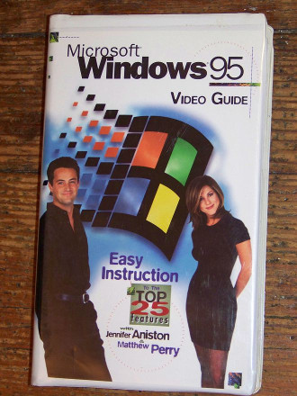

Over the 2018 Christmas holiday I decided to sit down and start on a project that has been on my mind for a long time: writing a 90s computer virus. This blog exists to chronicle my progress and hopefully spark your interest in retro computer viruses.

# Why a virus?

Growing up I was enamoured with [the .txt files that came out of what was then called the "computer underground"](http://textfiles.com/hacking/). Within this space of angsty teens and early internet culture I was particularly in love with a corner mostly referred to as "VX" for _**V**irus e**X**change_. Here you'd find people like _"Lord Julus"_ writing posts with names like ["Anti-Debugger & Anti-Emulator Lair"](http://ivanlef0u.fr/repo/madchat/vxdevl/vdat/tuantant.htm) and groups like [29a](https://cryptohub.nl/zines/vxheavens/29a/index.htm) (666 in hexadecimal - I hope you can already see the appeal) putting out ezines and prototype virii.

Much of this era was painstakingly catalogued on a website called _"VX Heavens"_. While its original home [met an unfair demise](https://nakedsecurity.sophos.com/2012/03/28/vx-heavens-virus-writing-website-raided/) there are still [mirrors online](https://cryptohub.nl/zines/vxheavens/lib/-index=OT&lang=en.htm) and [archives](https://archive.org/details/vxheavens-2010-05-18) to download. There were certainly problematic aspects of the VX scene I can't commend but the spirit of creativity, discovery and sharing of knowledge was truly unique.

# Why a 90s virus?

For broader context, in 1995 I was 7 years old. I was probably closer to 12 when I first started reading vx files. I probably understood less than 2% of anything I read at the time. Revisiting this subject today with a decade of professional experience is fascinating. Now I can both enjoy the spirit that appealed to me as a kid while also appreciating and implementing the technical aspects.

Despite being over 20 years old lots of the techniques detailed by great VXers of the era remain relevant fundamentals. The core technologies addressed by many articles still exist and are in use. In fact I bet whatever computer you're reading this on right now is still executing `PE` or `ELF` executables.

It may not be reflected in citations and RSA conference talks but topics that are now foundational areas of computer security and reverse engineering were pioneered not by academia or industry but by bored teenagers who wanted to [make other people's computers show a weed leaf](https://archive.org/details/malware_COFFSHOP.COM).

# Why a Windows 95 virus?

To start writing a virus I needed to decide on platforms and targets to support. My choice of Windows 95 was driven by both practical and emotional reasons.

From a historic standpoint Win95 marked an interesting inflection point in the VX scene. The DOS era had [huge number of viruses](https://www.youtube.com/watch?v=xgS1M4e_9_E) and VX publications but with the release of Win95 much of the community's knowledge was becoming obsolete. Just to start Win95 had [a brand new executable format](https://msdn.microsoft.com/en-us/library/ms809762.aspx), ran in [protected mode](https://en.wikipedia.org/wiki/Protected_mode), and operating system functions were accessed through a new API instead of [raw interrupts](http://stanislavs.org/helppc/int_21.html).

Windows 95 was also the first operating system I can remember exploring. My first computer was a [Tandy 1000](https://en.wikipedia.org/wiki/Tandy_1000) but it was fairly primitive and I was too young to explore deeply. By the time my family had a Win95 machine I was obsessed with it. I spent a lot of time looking at every single control panel setting and corner of the filesystem. We didn't have home Internet at the time so what counted as "fun" on the computer was certainly broader than today. I'm sure many of you that grew up in this time remember hours lost in `mspaint.exe`.

From a practical standpoint Win95 is appealing because it is modern enough to have things that will make my life easier (TCP/IP, filesharing, approachable development tools, a flat memory space, basically zero security features). It also runs reasonably well in VirtualBox so I can avoid purchasing any beige monstrosities on eBay.

For a challenge and to match VXer preference of the time I'll be writing my virus in pure [x86 assembly](https://en.wikipedia.org/wiki/X86_assembly_language). I have limited experience writing assembly so I wanted to be sure I picked a platform that wasn't too esoteric. There's a good deal of resources available about both general [Win95 Win32 programming in assembly](http://www.win32assembly.programminghorizon.com/tutorials.html) as well as VX specific resources for Win95. I've spent most of my career focused on Linux and UNIX systems so there's a lot of new ground for me to cover programming on and for Windows.

Lastly, targeting an operating system [18 years past the end of extended support](https://support.microsoft.com/en-us/lifecycle/search?alpha=Microsoft%20Windows%2095) means I can experiment with virus writing without worrying too much about destructive consequences and moral hangups. Don't run Windows 95 in the real world, I'm begging you.

# Where to start?

With some of the "Why" out of the way let's talk about short term goals and what I want to start out building.

1. **Vanilla infector.** My goal is to infect PE executables to propagate the virus without impacting the functionality of the infected application. Put simply, if you run an infected program it should work as intended to avert suspicion but also spread the virus by finding new programs to infect.
1. **KISS**. To start I'll ignore advanced techniques (polymorphism, encryptors, anti-debugging, etc) and focus on a minimal viable PE infector. This means I will largely be ignoring anti-virus detection to start with. I'll point out where I'm making a decision that will aid AVers but I will postpone developing countermeasures. (_Spoiler: Even using 90s tricks without concern for evasion will turn out to bypass detection from a surprising number of AV engines. More on that later..._)
1. **Windows 95 compatibility only.** It isn't too difficult to also support Windows NT and Windows 98 but I'm already biting off a lot so focusing on one platform will help manage complexity.
1. **No hard-coding offsets!** Even though I'm ignoring Windows NT and 98 I want to be reasonably confident the virus will run on different patch levels of Windows 95.
1. **100% assembly.** It's tempting to use C but to make this more of a challenge and to match the preferences of the VX scene in this era I'll use `x86` assembly only (likely targeting the `80386` or `80486`).
1. **Period accurate tools.** As much as anything I want to feel like a 90s Windows VXer and that means not using `vim` and a familiar toolset. Instead I'll find a 1990s text editor and use the compilers/debuggers available at the time.

This is ambitious and I tend to abandon projects before they're finished so I hope 
that by keeping the scope constrained initially and focusing on sharing in-progress work I can finish the above and move on to the more interesting advanced topics :-)

# Up Next

My next post will focus on setting up a Windows 95 VM, configuring it with internet access, setting up filesharing, and installing a `x86` assembly development environment.

I would love to hear feedback about this project, especially if you were someone active in the 90s vx scene. Feel free to drop me a line on twitter ([@cpu](https://twitter.com/cpu)) or by email ([daniel@binaryparadox.net](mailto://daniel@binaryparadox.net)).

Until next time,
